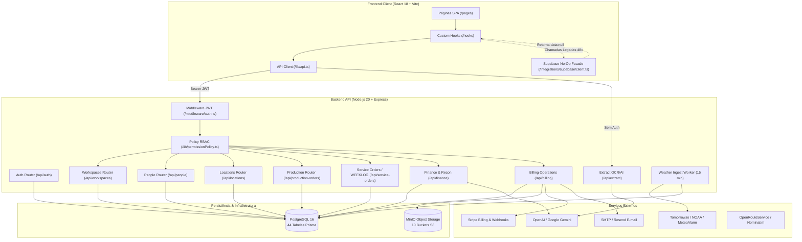
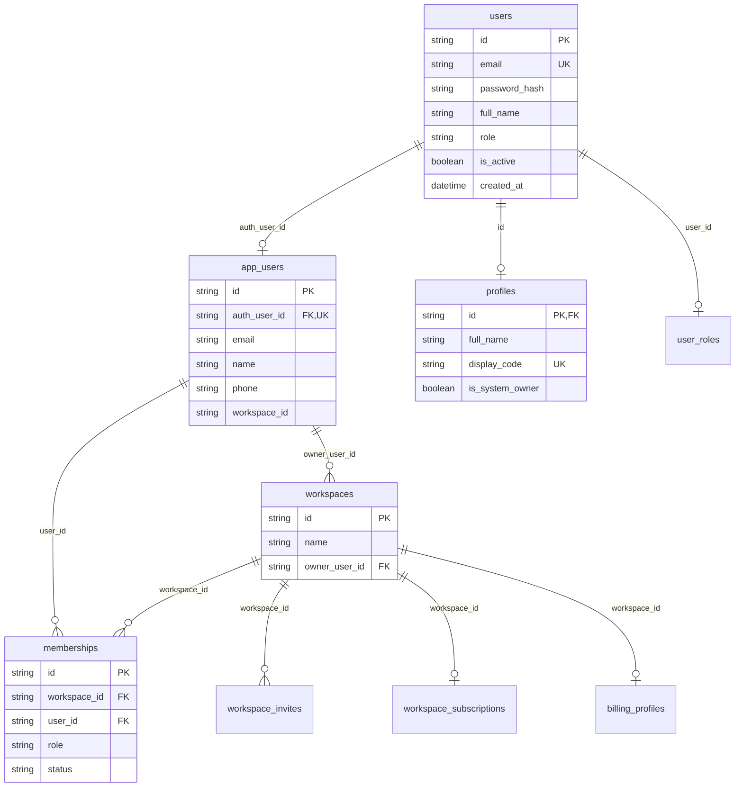
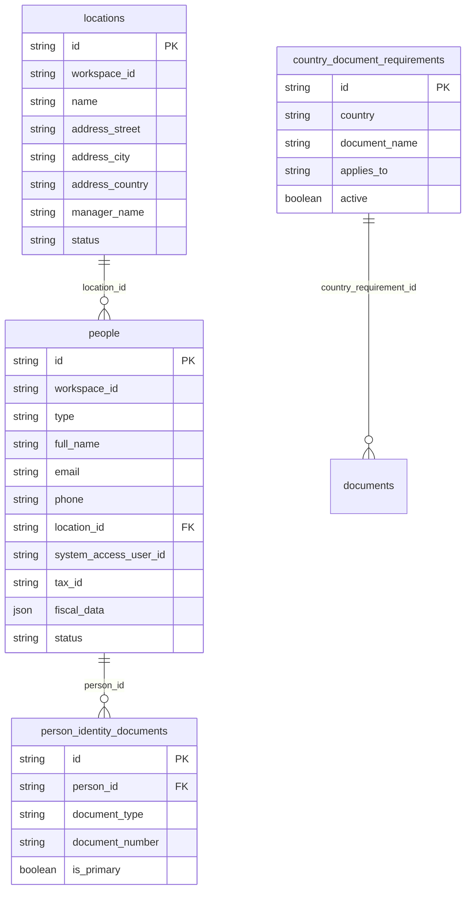
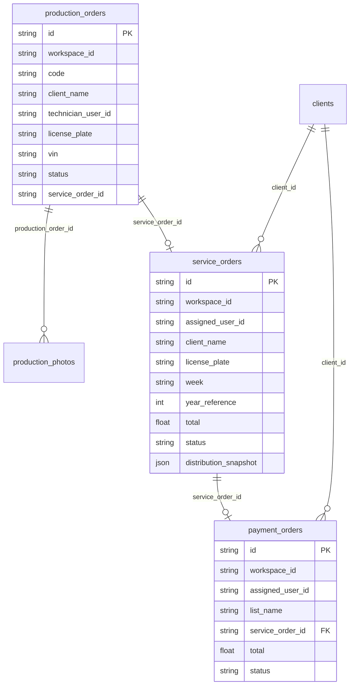
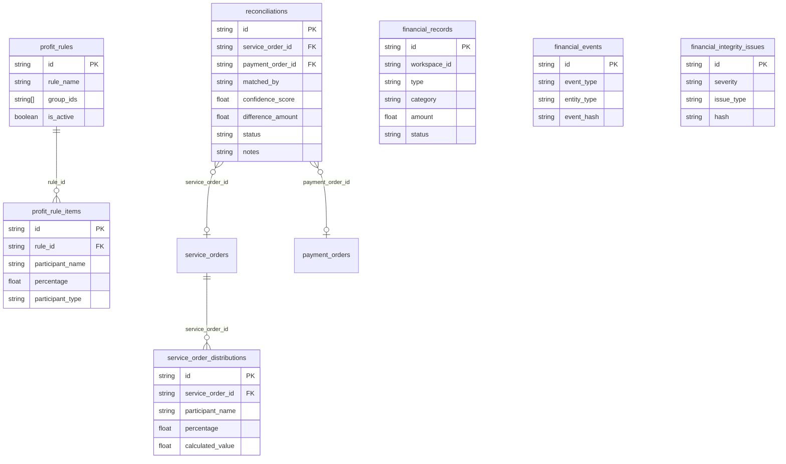

# Relatório de Diagnóstico: Arquitetura e Modelo de Dados (Fase 2)

**Projeto**: Operix (QW-Nexus)  
**Data**: 2026-09-05  
**Fase do Diagnóstico**: Fase 2 — Arquitetura e Modelo de Dados  
**Status**: Concluído ✅  
**Referencial Metodológico**: Spec-Driven Architecture & Domain-Driven Design (DDD) Audit  

---

## 1. Sumário Executivo

Este relatório apresenta a auditoria aprofundada da **Arquitetura de Software e do Modelo de Dados** da Operix, cobrindo o esquema relacional do Prisma ORM, o sistema de identidade e controle de acesso (RBAC), o modelo multi-tenant por workspaces, o pipeline operacional/financeiro de ponta a ponta e o estado de migração das 28 Edge Functions e serviços de armazenamento.

### Principais Conclusões da Fase 2:
1. **Esquema Relacional**: O `backend/prisma/schema.prisma` evoluiu para **44 modelos** cobrindo grande parte do core de OS, Produção, Financeiro, Pessoas, Locais e Meteorologia. Porém, há **débitos graves de modelagem** decorrentes do histórico de migrações parciais.
2. **Duplicação Crítica de Entidades**: Existem 3 tabelas distintas de Clientes (`Client`, `BillingClient`, `Person[type='client']`) e 4 representações de Identidade (`User`, `AppUser`, `Profile`, `Person`).
3. **Colaboradores vs Utilizadores**: São tratados como módulos isolados sem sincronização: `Person` gerencia dados cadastrais e compliance trabalhista/documental, enquanto `User`/`AppUser`/`Membership` gerenciam credenciais e login.
4. **Vulnerabilidade de Isolamento Multi-Tenant**: Diversas rotas da API (`/api/people`, `/api/locations`, `/api/service-orders`) recebem `workspace_id` via query string ou não filtram por workspace, permitindo vazamento horizontal de dados caso um usuário autenticado forje parâmetros (*IDOR / BOLA*).
5. **Endpoints Públicos de IA / OCR Desprotegidos**: As rotas `/api/extract/*` realizam chamadas a LLMs (OpenAI/Gemini) sem autenticação (`requireAuth` ausente), expondo o backend a consumo indevido de créditos e DoS.
6. **Descompasso de RBAC**: A rota `/admin/ops/clients` bloqueia usuários com role `"owner"` porque verifica estritamente `req.auth?.role !== 'admin'`.

---

## 2. Diagrama de Arquitetura e Fluxo de Dados



---

## 3. Modelo de Dados e Entidades (ERD e Análise Relacional)

O banco de dados relacional (PostgreSQL 16) gerenciado pelo Prisma ORM (`backend/prisma/schema.prisma`) totaliza **44 modelos**. Abaixo está o mapeamento detalhado por cluster de domínio:

### 3.1 Cluster de Identidade, Acesso e Tenancy



#### Problemas de Modelagem em Identidade:
- **Sobrecarga de Abstração**: O usuário é fragmentado em 3 tabelas 1-para-1 (`users`, `app_users`, `profiles`).
- **Desconexão com Pessoas**: A tabela `people` possui uma coluna solta `system_access_user_id` sem chave estrangeira formal (`@relation`) para `users` ou `app_users`.

---

### 3.2 Cluster de Cadastros: Pessoas, Locais e Compliance Documental



#### Auditoria Conceitual: Colaboradores vs Utilizadores
- **`Utilizadores` (`users` / `app_users` / `memberships`)**:
  - Representam **credenciais de login**, senhas com hash bcrypt, papéis no sistema (`admin`, `partner`, `technician`, `client`) e permissões de tela.
  - Administrados na tela `UsersPage` ([src/pages/ModulePages.tsx:1186](file:///c:/Users/Gustavo%20Fugulin/Downloads/operix/src/pages/ModulePages.tsx#L1186)) via endpoints `/api/workspaces/:id/members`.
- **`Colaboradores` (`people` / `locations` / `country_document_requirements`)**:
  - Representam o **ser humano no mundo físico**: dados civis (nome, data de nascimento, NIF/Tax ID), endereço, vínculo a uma `Location` (oficina/garagem/pátio), documentos de identidade múltiplos (`person_identity_documents`) e compliance regulatório por país (`documents` validados com data de expiração).
  - Administrados na tela `PeoplePage` ([src/pages/PeoplePage.tsx](file:///c:/Users/Gustavo%20Fugulin/Downloads/operix/src/pages/PeoplePage.tsx)) via endpoints `/api/people`.
- **Gargalo Arquitetural**: Não há sincronização automática nem trigger entre os dois. Criar um colaborador não cria o usuário de acesso, e criar um usuário de acesso não cria o colaborador.

---

### 3.3 Cluster Operacional: Produção → WEEKLOG → Pagamento



#### Ciclo de Dados e Sincronização Operacional:
1. **Entrada na Produção**: Uma `ProductionOrder` é aberta com dados do veículo e notas de orçamento.
2. **Finalização (Delivery)**: Quando `ProductionOrder.status = 'delivered'`, o hook `upsertWeeklogFromProduction()` ([backend/src/routes/productionOrders.ts:274](file:///c:/Users/Gustavo%20Fugulin/Downloads/operix/backend/src/routes/productionOrders.ts#L274)):
   - Calcula a semana operacional (domingo a sábado).
   - Trata regras de retificação (sufixo `W26A` se a entrega ocorreu fora da semana esperada).
   - Cria/atualiza o registro em `service_orders` (WEEKLOG).
   - Cria a estrutura de pastas em `documents` (`Week XX` -> `Veículo`) e vincula as fotos sem duplicar bytes no storage.
3. **Validação no WEEKLOG**: Quando o gestor valida o checklist da intervenção no diálogo do WEEKLOG:
   - Dispara `createPaymentOrderFromValidatedWeeklog()` ([backend/src/routes/serviceOrders.ts:227](file:///c:/Users/Gustavo%20Fugulin/Downloads/operix/backend/src/routes/serviceOrders.ts#L227)).
   - Gera o código sequencial determinístico da **Lista de Pagamento** (padrão `L010132`).
   - Insere o registro na tabela `payment_orders`.

---

### 3.4 Cluster Financeiro: Reconciliação, Distribuição e Auditoria



---

## 4. Matriz de Migração das Edge Functions do Supabase

Das **28 Edge Functions** identificadas em `supabase/functions/`, o status real de porte para a API própria Node.js/Express é o seguinte:

| # | Edge Function Supabase | Status de Porte | Endpoint / Arquivo Destino no Backend Express |
|---|---|---|---|
| 01 | `admin-create-user` | **PORTADO** | `POST /api/workspaces/:id/members` ([backend/src/routes/workspaces.ts](file:///c:/Users/Gustavo%20Fugulin/Downloads/operix/backend/src/routes/workspaces.ts)) |
| 02 | `calculate-route` | **PORTADO** | `POST /api/route/calculate` ([backend/src/routes/routeCalc.ts](file:///c:/Users/Gustavo%20Fugulin/Downloads/operix/backend/src/routes/routeCalc.ts)) |
| 03 | `company-lookup` | **PORTADO** | `POST /api/extract/company-search` ([backend/src/routes/extract.ts](file:///c:/Users/Gustavo%20Fugulin/Downloads/operix/backend/src/routes/extract.ts)) |
| 04 | `create-checkout` | **PORTADO** | `POST /api/billing/checkout/session` ([backend/src/routes/billing.ts](file:///c:/Users/Gustavo%20Fugulin/Downloads/operix/backend/src/routes/billing.ts)) |
| 05 | `create-portal-session` | **PORTADO** | `POST /api/billing/portal/session` ([backend/src/routes/billing.ts](file:///c:/Users/Gustavo%20Fugulin/Downloads/operix/backend/src/routes/billing.ts)) |
| 06 | `detect-discrepancies` | **PORTADO** | `POST /api/finance/reconciliations/run` ([backend/src/routes/finance.ts](file:///c:/Users/Gustavo%20Fugulin/Downloads/operix/backend/src/routes/finance.ts)) |
| 07 | `extract-invoice` | **PORTADO** | `POST /api/extract/invoice` ([backend/src/routes/extract.ts](file:///c:/Users/Gustavo%20Fugulin/Downloads/operix/backend/src/routes/extract.ts)) |
| 08 | `extract-payment-order` | **PORTADO** | `POST /api/extract/payment-order` ([backend/src/routes/extract.ts](file:///c:/Users/Gustavo%20Fugulin/Downloads/operix/backend/src/routes/extract.ts)) |
| 09 | `extract-production-order` | **PORTADO** | `POST /api/extract/production-order` ([backend/src/routes/extract.ts](file:///c:/Users/Gustavo%20Fugulin/Downloads/operix/backend/src/routes/extract.ts)) |
| 10 | `extract-receipt` | **PORTADO** | `POST /api/extract/receipt` ([backend/src/routes/extract.ts](file:///c:/Users/Gustavo%20Fugulin/Downloads/operix/backend/src/routes/extract.ts)) |
| 11 | `extract-service-order` | **PORTADO** | `POST /api/extract/service-order` ([backend/src/routes/extract.ts](file:///c:/Users/Gustavo%20Fugulin/Downloads/operix/backend/src/routes/extract.ts)) |
| 12 | `financial-ai-insights` | **PORTADO** | `POST /api/finance/ai-insights` ([backend/src/routes/finance.ts](file:///c:/Users/Gustavo%20Fugulin/Downloads/operix/backend/src/routes/finance.ts)) |
| 13 | `generate-invoice-pdf` | **PARCIAL** | Geração cliente via `budgetPdfUtils.ts` + `simplePdf.js` no backend |
| 14 | `ingest-hail` | **PORTADO** | `runWeatherIngest()` background service ([backend/src/services/weatherIngest.ts](file:///c:/Users/Gustavo%20Fugulin/Downloads/operix/backend/src/services/weatherIngest.ts)) |
| 15 | `payments-webhook` | **PORTADO** | `POST /api/billing/webhooks/stripe` ([backend/src/routes/billing.ts](file:///c:/Users/Gustavo%20Fugulin/Downloads/operix/backend/src/routes/billing.ts)) |
| 16 | `run-billing-automation` | **PORTADO** | `POST /api/billing/operations/run` ([backend/src/routes/billingOperations.ts](file:///c:/Users/Gustavo%20Fugulin/Downloads/operix/backend/src/routes/billingOperations.ts)) |
| 17 | `run-reconciliation` | **PORTADO** | `POST /api/finance/reconciliations/run` ([backend/src/routes/finance.ts](file:///c:/Users/Gustavo%20Fugulin/Downloads/operix/backend/src/routes/finance.ts)) |
| 18 | `send-invoice-email` | **PORTADO** | `POST /api/billing/invoices/:id/send-email` ([backend/src/routes/billingOperations.ts](file:///c:/Users/Gustavo%20Fugulin/Downloads/operix/backend/src/routes/billingOperations.ts)) |
| 19 | `agent-chat` | **NÃO PORTADO** | Inexistente no Express (agentes IA no frontend chamando Supabase desativado) |
| 20 | `ai-action` | **NÃO PORTADO** | Inexistente no Express |
| 21 | `ai-orchestrator` | **NÃO PORTADO** | Inexistente no Express (usado em `useAIOrchestrator.ts`) |
| 22 | `extract-fleet-document` | **NÃO PORTADO** | Inexistente no Express (módulo Fleet pendente de migração) |
| 23 | `process-invoice-emails` | **NÃO PORTADO** | Inexistente no Express |
| 24 | `reset-system` | **NÃO PORTADO** | Inexistente no Express (chamado em `ModulePages.tsx:1439`) |
| 25 | `run-automation-engine` | **NÃO PORTADO** | Inexistente no Express (chamado em `useAutomationEngine.ts`) |
| 26 | `sentry-tunnel` | **DESATIVADO** | Inexistente no Express (bypass em `src/main.tsx`) |
| 27 | `test-invites` | **DESATIVADO** | Script utilitário descartado |
| 28 | `_shared` | **DESATIVADO** | Utilitários Deno legados |

---

## 5. Auditoria de Segurança, Permissões e Multi-Tenancy

### 5.1 RBAC (Role-Based Access Control)
- **Definição de Papéis**: [backend/src/lib/permissionPolicy.ts](file:///c:/Users/Gustavo%20Fugulin/Downloads/operix/backend/src/lib/permissionPolicy.ts) padroniza 5 roles: `owner`, `admin`, `partner`, `technician`, `client`.
- **Falha de Consistência**:
  - Em `backend/src/routes/billingOperations.ts:117`, a função `requireAdmin()` faz:
    ```typescript
    if (req.auth?.role !== "admin") {
      res.status(403).json({ message: "Forbidden." });
      return false;
    }
    ```
    Usuários com role `"owner"` (proprietários do sistema) recebem **403 Forbidden** ao tentar gerenciar clientes fiscais ou faturas operacionais.

### 5.2 Risco de Vazamento Multi-Tenant (BOLA / IDOR)
- **Evidências**:
  - `GET /api/people` ([backend/src/routes/people.ts:80](file:///c:/Users/Gustavo%20Fugulin/Downloads/operix/backend/src/routes/people.ts#L80)): Não filtra por `workspace_id`. Retorna pessoas de todos os workspaces da base.
  - `GET /api/locations` ([backend/src/routes/locations.ts:50](file:///c:/Users/Gustavo%20Fugulin/Downloads/operix/backend/src/routes/locations.ts#L50)): Não filtra por `workspace_id`. Retorna locais de todos os workspaces da base.
  - `GET /api/service-orders` ([backend/src/routes/serviceOrders.ts:299](file:///c:/Users/Gustavo%20Fugulin/Downloads/operix/backend/src/routes/serviceOrders.ts#L299)): Confia cegamente no parâmetro `?workspace_id=...` enviado pelo cliente, sem verificar se o `req.auth.userId` possui membership ativo naquele workspace.

### 5.3 Endpoints de Extração sem Autenticação
- **Evidência**: [backend/src/routes/extract.ts:6](file:///c:/Users/Gustavo%20Fugulin/Downloads/operix/backend/src/routes/extract.ts#L6)
- **Diagnóstico**: As rotas `POST /api/extract/production-order`, `POST /api/extract/service-order`, `POST /api/extract/payment-order`, `POST /api/extract/invoice` e `POST /api/extract/receipt` não possuem o middleware `requireAuth`.
- **Risco**: Qualquer agente externo não autenticado pode enviar imagens base64, disparando requisições pagas para OpenAI/Gemini e consumindo cotas/créditos de API da Operix.

---

## 6. Armazenamento e Realtime

### 6.1 MinIO S3 SDK vs Supabase Storage
- **Backend**: Implementado com sucesso em [backend/src/lib/minio.ts](file:///c:/Users/Gustavo%20Fugulin/Downloads/operix/backend/src/lib/minio.ts) e [backend/src/routes/storage.ts](file:///c:/Users/Gustavo%20Fugulin/Downloads/operix/backend/src/routes/storage.ts). Suporta 10 buckets (`uploads`, `avatars`, `production-photos`, `billing-receipts`, etc.) com streaming autenticado (`/api/storage/file/:bucket/*`) e público (`/api/storage/public/:bucket/*`).
- **Frontend**: O helper `src/lib/storage.ts` aponta para o backend, mas telas como `FleetPage` e `AccountingLegacy` ainda tentam usar `supabase.storage.from()`, caindo no `noopSupabaseFacade`.

### 6.2 Situação do Realtime
- **Diagnóstico**: O Supabase Realtime foi desativado. Arquivos como `RealtimeHub.ts` e `OperationalEventBus.ts` utilizam mocks ou canais silenciosos.
- **Impacto**: O radar de granizo e o quadro de produção operam atualmente sem push em tempo real, dependendo de refetch manual ou invalidação via React Query.
