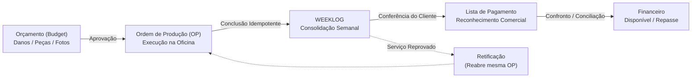

# Operix — Modelo de Domínio (DDD)

Este documento estabelece a verdade de negócio para o sistema Operix, formalizada após as validações da auditoria e reuniões de alinhamento com o cliente.

---

## 1. Identidade e Atores do Sistema

O sistema separa claramente **Autenticação**, **Pessoa Operacional** e **Acesso ao Workspace**:

```text
┌─────────────────┐       ┌─────────────────┐
│      User       │───────│     Profile     │
│ (Auth/Password) │       │ (Display/Avatar)│
└────────┬────────┘       └─────────────────┘
         │
         ├─── 1:N ───> Membership ─── N:1 ───> Workspace (Empresa)
         │
         └─── 1:1 ───> Person (Cadastro Operacional / RH)
```

### Papéis e Contextos de Atuação:
1. **Técnico Independente (*Personal Context*)**:
   - Atua de forma autônoma, sem intermediação de uma oficina/empresa.
   - Possui seus próprios clientes, orçamentos, ordens de produção e faturamento.
   - Não requer estrutura hierárquica corporativa de workspace.
2. **Técnico Vinculado (*Workspace Context*)**:
   - Opera como membro (`Membership`) de um Workspace.
   - **Regra de Visibilidade Estrita**: Um técnico vinculado enxerga **apenas a sua própria produção e o seu próprio extrato financeiro** (`scope = own`). Nunca tem acesso ao faturamento total da empresa ou de outros técnicos.
3. **Owner / Administrador do Workspace**:
   - Possui controle operacional e financeiro total sobre o seu Workspace.
   - Não tem visibilidade ou autoridade sobre outros Workspaces de terceiros.
4. **Cliente Operacional**:
   - Empresa ou concessionária contratante dos serviços.
   - Pode possuir colaboradores próprios com permissões específicas de validação ou recepção de veículos no Operix.

---

## 2. Ciclo Operacional do Core



### Invariantes do Fluxo Operacional:
1. **Orçamento e Revisões**:
   - Um orçamento aprovado torna-se imutável em sua versão histórica.
   - Qualquer alteração material posterior gera uma nova versão de revisão (`BudgetRevision`), exigindo nova aprovação do cliente.
2. **Conclusão de OP $\rightarrow$ WEEKLOG**:
   - Concluir uma OP cria ou recupera o registro de WEEKLOG de forma atômica e idempotente.
   - Falhas transitórias no disparo de efeitos derivados devem resultar em estado de pendência recuperável, nunca em perda silenciosa de dados.
3. **Retificação de Serviço**:
   - Quando um serviço sofre reprovação ou desconto por não conformidade técnica, ele **retorna ao fluxo de produção da mesma ordem original**.
   - O técnico executor pode ser alterado para a retificação, mantendo o histórico de linhagem do reparo.

---

## 3. WEEKLOG versus Lista de Pagamento

> [!IMPORTANT]
> **WEEKLOG $\neq$ Lista de Pagamento**. Esta é uma distinção conceitual crítica de domínio:

* **WEEKLOG**:
  - Representa a **realidade física e técnica executada** agrupada pela semana de trabalho da oficina.
  - É a base do esforço produtivo dos técnicos.
* **Lista de Pagamento (*PaymentList*)**:
  - Representa o **reconhecimento comercial e financeiro** emitido pelo cliente contratante.
  - Uma única Lista pode consolidar veículos executados em **múltiplas semanas distintas**.
  - O faturamento comercial e a conciliação dependem estritamente da Lista.

---

## 4. O Confronto (Reconciliação Operacional)

O Confronto é o processo de comparação entre:
* O que a oficina declarou ter executado (**WEEKLOGs**);
* O que o cliente auditou e aceitou pagar (**Lista do Cliente importada via planilha ou OCR**).

### Regras do Confronto:
- Identificação primária por Chassi / Placa do veículo;
- Verificação item a item: serviço executado, quantidade de mossas/peças e valor;
- Estados possíveis por item:
  - `MATCHED`: Valores e serviços idênticos;
  - `ACCEPTED_DIFFERENCE`: Diferença negociada e aceita pelo gestor;
  - `REJECTED`: Item glosado pelo cliente;
  - `NEEDS_RECTIFICATION`: Serviço precisa ser retrabalhado na oficina.

---

## 5. Fórmulas Canônicas do Financeiro

Todas as consultas, relatórios e telas financeiras devem respeitar rigorosamente esta árvore de derivação:

$$\begin{aligned}
\text{Executado}   &= \sum \text{WEEKLOG (Trabalhos Concluídos)} \\
\text{Reconhecido} &= \sum \text{Lista (Trabalhos Aceitos pelo Cliente)} \\
\text{Esperado}    &= \sum \text{Lista Validada com Pagamento Pendente} \\
\text{Recebido}    &= \sum \text{Lista Marcada como Paga} \\
\text{Disponível}  &= \text{Recebido} - \sum \text{Despesas Operacionais Pagas}
\end{aligned}$$

* **Repasse a Técnicos**: Calculado sobre o valor reconhecido e liberado conforme a política de distribuição (manual no MVP), sem antecipação de saldo não realizado.
* **Precisão Numérica**: Todos os valores monetários devem ser manipulados e persistidos com precisão decimal exata (`Prisma.Decimal` / centavos), nunca com ponto flutuante IEEE-754 (`float`).
