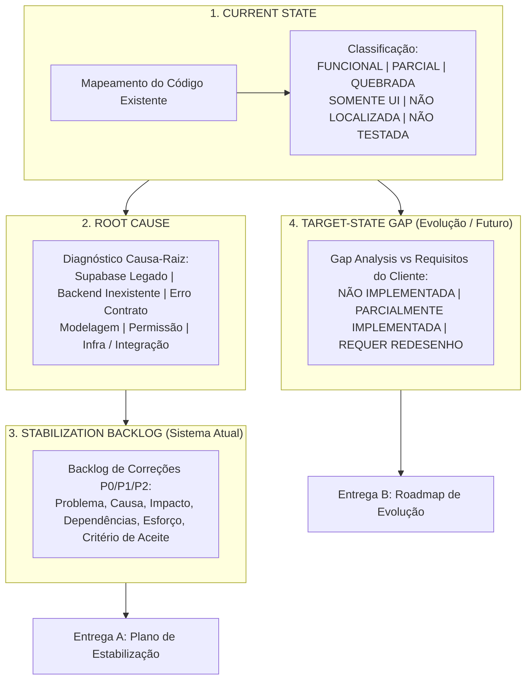

# Feature Specification: Diagnóstico Técnico Brownfield Operix

**Feature Branch**: `000-operix-diagnostic`  
**Created**: 2026-09-05  
**Status**: Em Execução (Fases 1, 2, 3 e 4A Concluídas; Fase 4B Pendente)  
**Input**: Diagnóstico Técnico Brownfield e Gap Analysis com evidências no código para estabilização e evolução da Operix  

---

## 1. Visão Geral e Contexto

A **Operix** (anteriormente referenciada como *QW-Nexus*) é uma plataforma de gestão operacional e financeira focada no setor automotivo e de reparação PDR (*Paintless Dent Repair* / Martelinho de Ouro). O sistema foi originalmente prototipado/gerado via Lovable com forte acoplamento ao ecossistema Supabase (Auth, PostgREST, Realtime, Storage, Edge Functions) e atualmente encontra-se em processo de migração para infraestrutura própria (VPS Docker, API Node.js/Express com Prisma ORM, PostgreSQL, MinIO e autenticação JWT).

O objetivo desta auditoria é transformar o próprio repositório na fonte da verdade, estruturando o diagnóstico em **QUATRO CAMADAS DE ANÁLISE RIGOROSAS**, distinguindo claramente defeitos do sistema atual de novas demandas de produto.

---

## 2. As Quatro Camadas do Diagnóstico

### 2.1 Camada 1: CURRENT STATE (Estado Atual)
Mapear o que existe hoje no código e classificar cada módulo/tela:
- **`FUNCIONAL`**: Funcionalidade possui interface, integração REST completa, validação de payload, persistência no banco de dados e sobrevive a recarregamento.
- **`PARCIAL`**: Funcionalidade opera em fluxos específicos, mas apresenta degradações (ex.: salva entidade pai mas ignora relações, perde filtros, ou carece de tratamento de erro).
- **`QUEBRADA`**: Funcionalidade dispara erros em tempo de execução (ex.: HTTP 500, unhandled rejection, exceção não tratada, deadlock ou mutação inválida).
- **`SOMENTE UI`**: Elementos de interface (botões, modais, formulários) que não realizam chamadas de rede, disparam apenas toasts/mocks locais ou chamam clientes desativados (`noopSupabaseFacade`).
- **`NÃO LOCALIZADA`**: Funcionalidade descrita no modelo de negócio ou documentação cujo código fonte inexiste no repositório.
- **`NÃO TESTADA`**: Código existente no repositório cuja execução automatizada ou manual ainda não foi aferida nesta auditoria.

### 2.2 Camada 2: ROOT CAUSE (Causa-Raiz Técnica)
Para cada item classificado como `PARCIAL` ou `QUEBRADA`, identificar e documentar a causa técnica fundamental:
- **Frontend ainda ligado ao Supabase legado**: Hooks/componentes chamando SDK Supabase interceptado pela *noop facade*.
- **Backend inexistente**: Rota ou serviço correspondente não implementado no Express.
- **Endpoint incorreto**: Path, método HTTP ou parâmetros divergentes entre frontend e backend.
- **Contrato frontend/backend divergente**: Payloads com chaves diferentes (ex.: camelCase vs snake_case) ou falhas de validação no Zod.
- **Problema de persistência**: Mutação não executa commit, perde dados relacionais ou falha em foreign keys.
- **Problema de modelagem**: Entidades duplicadas, ausência de colunas necessárias ou integridade referencial ausente.
- **Autorização/permissão**: Bloqueio indevido por RBAC (ex.: role `owner` bloqueado em rotas de `admin`) ou ausência de isolamento multi-tenant.
- **Infraestrutura**: Falha em volumes, variáveis de ambiente ou containers Docker.
- **Integração externa**: Falha em APIs de terceiros (Stripe, Tomorrow.io, OpenRoute, Resend).
- **Outro**: Lógica de negócio falha, concorrência ou bugs de UI.

### 2.3 Camada 3: STABILIZATION BACKLOG (Backlog de Estabilização do Sistema Atual)
Backlog estruturado do que precisa ser consertado no sistema atual, priorizado em **P0 / P1 / P2**:
- **Problema**: Descrição factual do defeito.
- **Causa**: Causa-raiz técnica identificada.
- **Impacto**: Consequência operacional ou de segurança.
- **Dependências**: Requisitos prévios para resolução.
- **Módulos Afetados**: Arquivos e telas impactadas.
- **Esforço Relativo**: Estimativa de complexidade técnica.
- **Critério de Aceite**: Condição verificável para encerramento do item.

### 2.4 Camada 4: TARGET-STATE GAP (Gap Analysis de Evolução)
Comparação estruturada entre o sistema existente e os requisitos novos/esperados do cliente.  
**Regra Estrita**: Funcionalidade nunca implementada **JAMAIS é classificada como BUG**, mas sim como:
- **`NÃO IMPLEMENTADA`**: Requisito de negócio que inexiste no repositório.
- **`PARCIALMENTE IMPLEMENTADA`**: Requisito que possui apenas estrutura inicial ou protótipo, necessitando de extensão.
- **`REQUER REDESENHO`**: Requisito implementado de forma incompatível com o modelo de domínio alvo.

Para cada gap registrado:
- **Regra de negócio esperada**
- **Implementação existente**
- **Diferença encontrada**
- **Dependências arquiteturais**
- **Impacto no negócio**
- **Recomendação para fase futura**

#### Requisitos Alvo Conhecidos para o Gap Analysis:
1. **Ficha Visual PDR por Peça**: Mapeamento interativo da carroceria do veículo dividida por peças.
2. **Fotos por Peça do Veículo**: Associação direta de evidências fotográficas à peça danificada.
3. **Estimativa Assistida por IA**: Contagem e classificação automática da severidade/tamanho dos danos de granizo.
4. **Consolidação do Total de Danos**: Totalização inteligente da intervenção com cálculo de horas/unidades.
5. **Preço / Forfait Manual**: Flexibilidade para precificação por tabela fixa, peça ou valor fechado.
6. **Documentos White-Label e Multilíngues**: Personalização total de relatórios/faturas por workspace e idioma (PT, EN, FR, DE, ES, IT).
7. **Separação Rigorosa entre Colaboradores e Utilizadores**: Unificação do cadastro físico de RH vs Contas de Acesso.
8. **Evolução do Módulo Colaboradores / RH**: Gestão de documentos de identidade múltiplos e compliance por país.
9. **Vínculo Opcional de Acesso ao Sistema**: Criação de usuário e convite disparados a partir da ficha do colaborador.

---

## 3. Macro Plano de 7 Fases

- **Fase 1 — Inventário do Repositório** (CONCLUÍDA ✅)
- **Fase 2 — Arquitetura e Modelo de Dados** (CONCLUÍDA ✅)
- **Fase 3 — Inventário Funcional (Current State & Root Cause)** (CONCLUÍDA ✅)
- **Fase 4 — Reprodução dos Fluxos, Contratos e Bugs**
- **Fase 5 — Segurança, Performance e Dívida Técnica**
- **Fase 6 — Gap Analysis: Current State vs Target State**
- **Fase 7 — Backlog Consolidado e Roadmap Estratégico (A. Estabilização | B. Evolução)**

---

## 4. Requisitos e Regras da Auditoria

- **REQ-001**: Nenhuma conclusão sem evidência de código (arquivo, linha, endpoint, tabela).
- **REQ-002**: Não alterar código de produto em nenhuma hipótese.
- **REQ-003**: Não mascarar falhas nem confiar em telas sem validar persistência e rede.
- **REQ-004**: Separar rigorosamente **Correções do Sistema Atual** de **Novas Funcionalidades / Evolução**.
