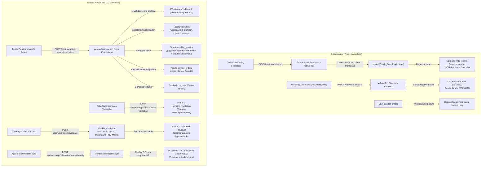

# Spec 003 — Mobile Operational Flow: Production → WEEKLOG, Batch Validation & Versioned Rectification

**Status**: Ready for Implementation  
**Prioridade**: P1 (Core Operacional)  
**Fase de Engenharia**: R1 — Operação Móvel  
**Data**: 2026-09-17  
**Branch de Trabalho**: `feat/003-production-weeklog`  
**Base de Integração**: `develop/operix-core` (Spec 001 e Spec 002 integradas)  

---

## 1. Contexto e Problema

O Operix gerencia o ciclo operacional automotivo de reparação, funilaria e martelinho de ouro (PDR). Após a estabilização do multi-tenancy e da autoridade server-side (Spec 001) e da persistência canônica de orçamentos com revisões e fotos associadas à Ordem de Produção (Spec 002), a presente especificação estabelece a vertical de **conclusão da Ordem de Produção (OP), consolidação no WEEKLOG semanal, validação em lote pelo cliente e ciclo formal de retificação versionada**.

A auditoria técnica e a revisão independente formalizaram os seguintes requisitos de estabilização:
1. **Erradicação de BOLA/IDOR nas Rotas de ServiceOrder**: Aplicação obrigatória de `RequestContext`, eliminando o uso de `workspace_id` e IDs enviados pelo cliente (*CWE-639 / OWASP API1*).
2. **Escopo do Técnico no Servidor (`scope: own`)**: Técnicos têm sua visibilidade estritamente filtrada por sua autoria/atribuição (`technicianUserId`).
3. **Fim de Mutações em Requisições HTTP GET**: O endpoint de consulta torna-se puramente somente-leitura e idempotente.
4. **Separação Canônica entre WEEKLOG e Lista de Pagamento**: O ciclo encerra-se em **WEEKLOG VALIDATED**. Nenhuma tabela financeira (`payment_orders`, faturas ou listas) é criada nesta spec.
5. **Execução Versionada na Retificação**: Adoção de `executionSequence` (`@@unique([productionOrderId, executionSequence])`) e foreign key auto-referenciada em `rectificationOriginEntryId`, permitindo retificações múltiplas na mesma semana ou em semanas posteriores.
6. **Identidade Determinística do Lote sem Campos Nulos**: O cabeçalho `Weeklog` possui constraint `@@unique([workspaceId, startsOn, clientId, siteKey])`. `clientId` e `siteKey` são obrigatórios para a finalização da OP.
7. **Fuso Horário IANA Formal**: `Workspace.timezone` governa o cálculo determinístico de `startsOn` (Domingo 00:00:00 UTC) com fallback universal para `"UTC"`.
8. **Serviços Estruturados com Decimais em OPs Diretas**: Ordens diretas utilizam `performedServices` com strings normalizadas e cálculo em `Prisma.Decimal`.
9. **Validação em Lote e Proibição de Auto-Validação**: Validação em lote via `submitForValidation` e `validateWeeklogBatch` (`WeeklogValidation` versionado). Bloqueio estrito de auto-validação caso o validador tenha executado qualquer entry do lote (`VALIDATOR-BATCH-SELF-01`).
10. **Assinatura Gráfica Governada em PNG**: Canvas móvel restrito a PNG (validação de magic bytes, limite 1 MB; SVGs rejeitados). Congelamento imutável pós-validação.

---

## 2. Atores do Sistema e Regras de Validação

1. **Técnico Vinculado (*Workspace Context*)**:
   - Membro do workspace (`membershipRole: "technician"`).
   - Política `scope: "own"`: visualiza e opera exclusivamente suas próprias ordens de produção e entradas de WEEKLOG atribuídas.
   - Executa serviços e finaliza a OP. **Nunca pode validar a própria produção** (`VALIDATOR-SELF-01`).
2. **Técnico Independente (*Personal Context*)**:
   - Opera em seu *Personal Workspace* canônico ([ADR-002](file:///c:/Users/Gustavo%20Fugulin/Downloads/operix/docs/adr/002-personal-workspace-lifecycle.md)).
   - Conclui ordens e visualiza seu WEEKLOG consolidado. **Não pode auto-validar suas ordens**; a validação exige credencial formal do cliente contratante (`PERSONAL-TECH-SELF-VALIDATE-01`).
3. **Gestor / Administrador do Workspace**:
   - Possui autoridade sobre as ordens e relatórios de todos os técnicos do seu tenant.
4. **Validador do Cliente (*Client Access Grant*)**:
   - Representante formal do cliente contratante (frotista, concessionária, seguradora).
   - Possui conta autenticada no Operix com vínculo formal na tabela `client_access_grants` (`status: "active"`).
   - Realiza a conferência física e o aceite formal do lote semanal (`weeklog.validate`). Grants revogados são sumariamente rejeitados.

---

## 3. Current State vs. Target State



---

## 4. Invariantes de Negócio e Segurança

- **INV-001 (RequestContext Mandatório)**: 100% dos endpoints do fluxo de produção, finalização, WEEKLOG, validação e retificação obedecem a `requireAuth` + `resolveRequestContext` e aplicam `assertTenantAccess(ctx, resource.workspaceId)`.
- **INV-002 (Visibilidade do Técnico - Scope Own)**: Técnicos vinculados (`membershipRole: "technician"`) só visualizam e operam registros onde `technicianUserId === ctx.actorUserId` ou `assignedUserId === ctx.actorUserId`. Tentativas de acesso a trabalhos de outros técnicos retornam HTTP 403 Forbidden.
- **INV-003 (Separação Canônica WEEKLOG $\neq$ Lista de Pagamento)**: A validação de WEEKLOG encerra-se em `status: "validated"`. É terminantemente proibido criar `PaymentOrder`, gerar código de lista (`listName`), ou remover itens validados do WEEKLOG nesta fatia vertical.
- **INV-004 (Transação Atômica com Bloqueio Pessimista e P2002 Externo)**: A finalização da OP ocorre em `prisma.$transaction` com `SELECT ... FOR UPDATE` na `ProductionOrder`. Falhas de colisão `P2002` são tratadas **fora** da transação abortada através de re-leitura isolada.
- **INV-005 (Execução Versionada na Retificação)**: A tabela `weeklog_entries` possui a constraint estrutural `@@unique([productionOrderId, executionSequence])`. Cada reabertura formal incrementa `ProductionOrder.executionSequence`, permitindo múltiplas retificações da mesma ordem.
- **INV-006 (Linhagem Estrutural de Retificação)**: O campo `rectificationOriginEntryId` é uma foreign key relacional auto-referenciada apontando para `WeeklogEntry.id` com `onDelete: Restrict`. A nova entrada aponta para a entrada imediatamente anterior que originou o retrabalho.
- **INV-007 (Identidade Determinística sem Campos Nulos)**: O cabeçalho `Weeklog` possui constraint `@@unique([workspaceId, startsOn, clientId, siteKey])`. Toda finalização de OP exige obrigatoriamente um `clientId` canônico e um `operationalSiteKey` resolvido (erro 422 se ausentes).
- **INV-008 (Fuso Horário IANA no Workspace)**: O fuso horário de referência é armazenado em `Workspace.timezone` (fallback universal `"UTC"`). O marco `startsOn` (Domingo 00:00:00) deriva do fuso horário configurado no workspace e é persistido em UTC. `Weeklog.timezone` armazena o snapshot utilizado.
- **INV-009 (Granularidade de Validação em Lote e `submitForValidation`)**: O fluxo de validação exige a transição formal `open` $\rightarrow$ `pending_validation` via `submitForValidation`, congelando o `coverageSnapshot`. O aceite do lote gera um registro versionado `WeeklogValidation` com `validationSequence Int` incremental.
- **INV-010 (Proibição Estrita de Auto-Validação em Lote)**: Se o usuário autenticado (`ctx.actorUserId`) coincidir com o `technicianUserId` de **qualquer** entrada coberta pelo lote, a validação é rejeitada com HTTP 403 Forbidden (`VALIDATOR-BATCH-SELF-01`).
- **INV-011 (Autoridade Server-Side de Identidade)**: O identificador `validatorUserId` é extraído exclusivamente do token JWT (`RequestContext`). Nome, cargo e matrícula são resolvidos server-side. O cliente HTTP não possui autoridade para declarar identidades auditáveis no payload.
- **INV-012 (Imutabilidade Financeira e Remoção de finalValue)**: A validação do WEEKLOG não altera valores monetários (`finalValue` é eliminado). `WeeklogEntry` congela `totalAmount` (`Decimal(12, 2)`) e `currencyCode` (ISO-4217 resolvido da `BudgetRevision` ou da `ProductionOrder`; erro 422 se ausente).
- **INV-013 (Serviços Estruturados em OPs Diretas com Decimais)**: OPs diretas devem possuir o campo estruturado `performedServices` com decimais em strings normalizadas. O backend calcula valores exclusivamente com `Prisma.Decimal`. OPs diretas sem serviços retornam HTTP 422 `DIRECT_OP_NO_SERVICES`.
- **INV-014 (Imutabilidade Pós-Validação)**: Uma entrada com status `approved` e um lote com status `validated` não podem ser editados in-place. Mutações diretas retornam HTTP 409 Conflict.
- **INV-015 (Integridade Multi-Tenant no PostgreSQL)**: Foreign keys compostas garantem isolamento no banco:
  - `(weeklogId, workspaceId) REFERENCES weeklogs(id, workspaceId) ON DELETE CASCADE`
  - `(productionOrderId, workspaceId) REFERENCES production_orders(id, workspaceId) ON DELETE RESTRICT`
  - `(rectificationOriginEntryId, workspaceId) REFERENCES weeklog_entries(id, workspaceId) ON DELETE RESTRICT`
  - `(clientId, workspaceId) REFERENCES clients(id, workspaceId) ON DELETE CASCADE`
- **INV-016 (ServiceOrder como Projeção Downstream)**: `Weeklog` e `WeeklogEntry` são a única Fonte da Verdade. `service_orders` é mantida como projeção downstream através do **Downstream Legacy Projection Adapter**. `WeeklogEntry.legacyServiceOrderId` vincula explicitamente cada execução à sua linha de compatibilidade.
- **INV-017 (Delegação da Finalização Legada)**: O handler legado `PATCH /api/production-orders/:id` com `status: "delivered"` delega obrigatoriamente a chamada ao comando canônico `finalizeProductionOrder`.
- **INV-018 (Governança e Imutabilidade da Assinatura PNG)**: Upload de assinatura gráfica ocorre previamente em staging MinIO, aceitando estritamente arquivos PNG (validação de magic bytes `89 50 4E 47`, limite 1 MB; SVGs são rejeitados). A validação em lote move o arquivo para o caminho definitivo e congela o registro. Modificações pós-validação retornam HTTP 409 Conflict.
- **INV-019 (Zero Mutações em HTTP GET)**: Requisições de leitura são rigorosamente somente-leitura e idempotentes.
- **INV-020 (Resiliência Concorrente)**: Colisões na constraint única de sequência de execução (código Prisma `P2002`) acionam re-leitura transacional fora da transação abortada, retornando a mesma entrada com HTTP 200.

---

## 5. Requisitos Funcionais

### RF-001: Finalização Canônica de Ordem de Produção
- `POST /api/production-orders/:id/finalize`
- Valida se a ordem está em andamento (`status === "in_production"` ou `"paused"`).
- Valida se a ordem possui `clientId` canônico associado (retorna HTTP 422 `CLIENT_REQUIRED` se nulo).
- Valida se a ordem possui `operationalSiteKey` resolvido (retorna HTTP 422 `OPERATIONAL_SITE_REQUIRED` se nulo ou vazio).
- Valida se a ordem possui `currencyCode` resolvido (retorna HTTP 422 `CURRENCY_REQUIRED` se nulo).
- Valida se a ordem possui serviços estruturados (se for OP direta, valida `performedServices` e decimais).
- Executa transação atômica com lock pessimista (`SELECT ... FOR UPDATE`):
  1. Se já finalizada na sequência corrente: retorna a entrada existente (HTTP 200).
  2. Atualiza `ProductionOrder.status = "delivered"`, `deliveredAt = now()`.
  3. Resolve a semana operacional no timezone do workspace.
  4. Realiza upsert do cabeçalho `Weeklog` (`workspaceId`, `startsOn`, `clientId`, `siteKey`).
  5. Cria `WeeklogEntry` congelando snapshot de veículo, cliente, técnico e serviços, com `executionSequence = po.executionSequence`.
  6. Sincroniza projeção legada em `service_orders` e atualiza `legacyServiceOrderId`.
  7. Gera pastas e fotos virtuais em `documents`.
- Retorno: HTTP 200 com a ordem finalizada e a entrada de WEEKLOG correspondente.

### RF-002: Consulta Canônica de WEEKLOGs e Entradas
- `GET /api/weeklogs`: Lista cabeçalhos de lotes com filtros opcionais (`startsOn`, `clientId`, `status`, `siteKey`).
- `GET /api/weeklogs/:id`: Retorna cabeçalho do lote com a coleção completa de itens (`entries`) e histórico de validações (`validations`).
- `GET /api/weeklogs/:id/entries/:entryId`: Retorna detalhes de uma entrada específica.
- Aplica filtro server-side estrito por `RequestContext`. Técnicos enxergam apenas suas próprias entradas (`scope: own`).

### RF-003: Submissão do Lote para Validação (Abertura de Validation Round)
- `POST /api/weeklogs/:id/submit-for-validation`
- Valida se o lote possui ao menos 1 entrada de execução.
- Transiciona `Weeklog.status` de `"open"` (ou `"rectification_pending"`) para `"pending_validation"`.
- Cria/abre a rodada de validação (`WeeklogValidation`) em estado pendente:
  - `status`: `"pending"`
  - `validationSequence`: Sequência incremental única do lote (`@@unique([weeklogId, validationSequence])`).
  - `coverageSnapshot`: Congela JSON estruturado com os IDs das entradas ativas submetidas, totais de itens e valor monetário total. **Estritamente imutável após a submissão** (novas ordens ou retries não alteram o snapshot).
  - `submittedAt`: Timestamp gerado com autoridade server-side no momento da transição (`DateTime?`).
  - `submittedBy`: Identificador do ator autenticado extraído estritamente do `RequestContext` (`ctx.actorUserId`). Nunca aceito de payload client-side.
- Retorno: HTTP 200 com a rodada pendente e o cabeçalho atualizado. Se já estiver em `pending_validation` com a mesma cobertura, retorna HTTP 200 de forma idempotente sem criar nova rodada.

### RF-004: Inspeção Individual de Itens de WEEKLOG
- `POST /api/weeklogs/:id/entries/:entryId/review`
- Permite ao validador marcar o resultado da conferência física do veículo:
  - `validationStatus`: `"approved"` ou `"rejected"`
  - `rejectionReason`: Motivo formal caso reprovado.
- Atualiza o item individual sem fechar o lote.

### RF-005: Validação e Assinatura em Lote do WEEKLOG (Conclusão da Validation Round)
- `POST /api/weeklogs/:id/validate`
- Payload Zod:
  - `validationMethod`: `"authenticated_confirmation"` ou `"drawn_signature"`
  - `signatureStoragePath`: Caminho do arquivo temporário no MinIO (se `drawn_signature`)
- Valida permissões do validador (rejeita se `ctx.actorUserId` executou qualquer item do lote — `VALIDATOR-BATCH-SELF-01`).
- Valida se o validador possui `ClientAccessGrant` ativo para o `clientId` do lote (rejeita com HTTP 403 se revogado ou inexistente).
- **Completa a MESMA Validation Round** que foi aberta no submit:
  - `status`: Transiciona para `"validated"`
  - `validatorUserId`: Preenchido com `ctx.actorUserId` autenticado
  - `validationMethod`: Método utilizado
  - `validatedAt`: Carimbo server-side da conclusão
  - `signatureStoragePath`: Caminho definitivo no MinIO (se assinatura desenhada)
- Move a assinatura gráfica do staging para o caminho definitivo:
  `tenants/{workspaceId}/weeklogs/{weeklogId}/signatures/{validationId}.png`.
- Atualiza `Weeklog.status` para `"validated"` (ou `"rectification_pending"` se houver itens reprovados).
- **Não cria `PaymentOrder`**. Retorna o lote validado com HTTP 200.

### RF-006: Upload Temporário de Assinatura (Staging MinIO)
- `POST /api/weeklogs/:id/signature-upload`
- Recebe arquivo de imagem (estritamente PNG) capturado via canvas.
- Valida magic numbers (`89 50 4E 47 0D 0A 1A 0A`) e tamanho máximo (1 MB). SVGs são rejeitados.
- Salva no MinIO sob caminho de staging:
  `tenants/{workspaceId}/weeklogs/{weeklogId}/signatures/temp_{uuid}.png`.
- Retorna `signatureStoragePath` temporário. Se o lote já estiver validado, retorna HTTP 409 Conflict.

### RF-007: Solicitação Formal de Retificação e Reabertura de OP
- `POST /api/weeklogs/:id/entries/:entryId/rectify`
- Payload Zod:
  - `reason`: Motivo detalhado do retrabalho técnico (obrigatório).
  - `assignedTechnicianUserId`: Técnico designado (opcional; valida regras TECH-ASSIGN).
- Executa transação atômica que:
  1. Altera `WeeklogEntry.validationStatus = "rectification_requested"`.
  2. Atualiza `Weeklog.status = "rectification_pending"`.
  3. Incrementa `ProductionOrder.executionSequence = executionSequence + 1`.
  4. Reabre a `ProductionOrder` para `status = "in_production"`, `finishedAt = null`, `deliveredAt = null`.
  5. Registra `ProductionOrder.rectificationOriginId = entryId`.
  6. Se informado novo técnico por gestor autorizado, atualiza o responsável.
- Retorno: HTTP 200 com a OP reaberta pronta para novo ciclo de oficina.

### RF-008: Saneamento das Rotas Legadas de ServiceOrder
- Em `backend/src/routes/serviceOrders.ts`:
  - Aplica `resolveRequestContext` obrigatoriamente.
  - Elimina todas as rotinas de escrita em `GET /service-orders`.
  - Elimina a invocação de `createPaymentOrderFromValidatedWeeklog`.
  - Mutações delegam chamadas para `weeklogService`.

---

## 6. Modelo Relacional e Schema Prisma (Canônico)

```prisma
model Workspace {
  id          String   @id @default(uuid())
  name        String
  type        String   @default("company")
  ownerUserId String   @map("owner_user_id")
  timezone    String   @default("UTC") // IANA timezone formal (ex: "Europe/Paris", "America/Sao_Paulo")
  createdAt   DateTime @default(now()) @map("created_at")

  // Relacionamentos existentes...
  weeklogs            Weeklog[]
  weeklogEntries      WeeklogEntry[]
  clientAccessGrants  ClientAccessGrant[]

  @@map("workspaces")
}

model ClientAccessGrant {
  id          String    @id @default(uuid())
  workspaceId String    @map("workspace_id")
  userId      String    @map("user_id")
  clientId    String    @map("client_id")
  role        String    @default("validator") // validator, manager
  status      String    @default("active")    // active, revoked
  grantedAt   DateTime  @default(now()) @map("granted_at")
  revokedAt   DateTime? @map("revoked_at")
  revokedBy   String?   @map("revoked_by")
  createdAt   DateTime  @default(now()) @map("created_at")

  workspace Workspace @relation(fields: [workspaceId], references: [id], onDelete: Cascade)
  client    Client    @relation(fields: [clientId, workspaceId], references: [id, workspaceId], onDelete: Cascade)

  @@unique([workspaceId, userId, clientId])
  @@index([workspaceId, userId])
  @@index([clientId, status])
  @@map("client_access_grants")
}

model ProductionOrder {
  id                  String    @id @default(uuid())
  workspaceId         String    @map("workspace_id")
  code                String
  clientId            String?   @map("client_id")
  clientName          String?   @map("client_name")
  technicianUserId    String?   @map("technician_user_id")
  technicianName      String?   @map("technician_name")
  platform            String?
  insurer             String?
  licensePlate        String?   @map("license_plate")
  vin                 String?
  brand               String?
  model               String?
  color               String?
  notes               String?
  operationalSiteKey  String?   @map("operational_site_key") // Local operacional canônico
  currencyCode        String?   @map("currency_code")        // Moeda ISO-4217 da ordem direta
  performedServices   Json?     @map("performed_services")   // Serviços estruturados com decimais normalizados
  priority            String    @default("normal")
  status              String    @default("new_vehicle")
  commercialStatus    String?   @map("commercial_status")
  serviceOrderId      String?   @map("service_order_id")
  executionSequence   Int       @default(1) @map("execution_sequence") // Sequência de execução (retificação)
  rectificationOriginId String? @map("rectification_origin_id")
  dueAt               DateTime? @map("due_at")
  startedAt           DateTime? @map("started_at")
  finishedAt          DateTime? @map("finished_at")
  deliveredAt         DateTime? @map("delivered_at")
  createdBy           String    @default("") @map("created_by")
  createdAt           DateTime  @default(now()) @map("created_at")
  updatedAt           DateTime  @updatedAt @map("updated_at")

  budgetId            String?   @unique @map("budget_id")
  budgetRevisionId    String?   @map("budget_revision_id")

  photos              ProductionPhoto[]
  weeklogEntries      WeeklogEntry[]
  workspace           Workspace @relation(fields: [workspaceId], references: [id], onDelete: Cascade)

  @@unique([id, workspaceId])
  @@index([workspaceId, status])
  @@map("production_orders")
}

model Weeklog {
  id            String    @id @default(uuid())
  workspaceId   String    @map("workspace_id")
  startsOn      DateTime  @map("starts_on") // Domingo 00:00:00 UTC (derivado do timezone do workspace)
  endsOn        DateTime  @map("ends_on")   // Sábado 23:59:59.999 UTC
  clientId      String    @map("client_id") // Cliente contratante obrigatório
  siteKey       String    @map("site_key")   // Local operacional canônico normalizado
  week          String    // ex: "2026-W33" (derivado/display)
  weekNumber    Int       @map("week_number") // derivado/display
  yearReference Int       @map("year_reference") // derivado/display
  status        String    @default("open") // open, pending_validation, validated, rectification_pending, closed
  timezone      String    @default("UTC") // Snapshot do timezone utilizado no cálculo
  createdAt     DateTime  @default(now()) @map("created_at")
  updatedAt     DateTime  @updatedAt @map("updated_at")

  workspace     Workspace         @relation(fields: [workspaceId], references: [id], onDelete: Cascade)
  client        Client            @relation(fields: [clientId, workspaceId], references: [id, workspaceId], onDelete: Restrict)
  entries       WeeklogEntry[]
  validations   WeeklogValidation[]

  @@unique([workspaceId, startsOn, clientId, siteKey])
  @@unique([id, workspaceId])
  @@index([workspaceId, status])
  @@map("weeklogs")
}

model WeeklogEntry {
  id                         String    @id @default(uuid())
  weeklogId                  String    @map("weeklog_id")
  workspaceId                String    @map("workspace_id")
  productionOrderId          String    @map("production_order_id")
  executionSequence          Int       @default(1) @map("execution_sequence")
  budgetId                   String?   @map("budget_id")
  budgetRevisionId           String?   @map("budget_revision_id")
  legacyServiceOrderId       String?   @map("legacy_service_order_id")
  technicianUserId           String    @map("technician_user_id")
  technicianName             String    @map("technician_name")
  clientId                   String    @map("client_id")
  clientName                 String    @default("") @map("client_name")
  brand                      String?
  model                      String?
  color                      String?
  licensePlate               String?   @map("license_plate")
  vin                        String?
  servicesSnapshot           Json      @default("[]") @map("services_snapshot")
  totalAmount                Decimal   @default(0) @db.Decimal(12, 2) @map("total_amount")
  currencyCode               String    @map("currency_code")
  deliveredAt                DateTime  @map("delivered_at")

  // Inspeção Individual
  validationStatus           String    @default("pending") @map("validation_status") // pending, approved, rejected, rectification_requested
  reviewedAt                 DateTime? @map("reviewed_at")
  reviewerUserId             String?   @map("reviewer_user_id")
  rejectionReason            String?   @map("rejection_reason")

  // Retificação
  isRectification            Boolean   @default(false) @map("is_rectification")
  rectificationOriginEntryId String?   @map("rectification_origin_entry_id")
  rectificationReason        String?   @map("rectification_reason")
  rectificationRequestedBy   String?   @map("rectification_requested_by")
  rectificationRequestedAt   DateTime? @map("rectification_requested_at")

  createdAt                  DateTime  @default(now()) @map("created_at")
  updatedAt                  DateTime  @updatedAt @map("updated_at")

  weeklog                  Weeklog          @relation(fields: [weeklogId, workspaceId], references: [id, workspaceId], onDelete: Cascade)
  productionOrder          ProductionOrder  @relation(fields: [productionOrderId, workspaceId], references: [id, workspaceId], onDelete: Restrict)
  workspace                Workspace        @relation(fields: [workspaceId], references: [id], onDelete: Cascade)
  client                   Client           @relation(fields: [clientId, workspaceId], references: [id, workspaceId], onDelete: Restrict)
  rectificationOriginEntry WeeklogEntry?    @relation("WeeklogEntryRectification", fields: [rectificationOriginEntryId, workspaceId], references: [id, workspaceId], onDelete: Restrict)
  rectifiedSubsequentEntries WeeklogEntry[] @relation("WeeklogEntryRectification")

  @@unique([productionOrderId, executionSequence])
  @@unique([id, workspaceId])
  @@index([workspaceId, validationStatus])
  @@index([technicianUserId])
  @@map("weeklog_entries")
}

model WeeklogValidation {
  id                   String    @id @default(uuid())
  weeklogId            String    @map("weeklog_id")
  workspaceId          String    @map("workspace_id")
  validationSequence   Int       @default(1) @map("validation_sequence")
  validatorUserId      String    @map("validator_user_id")
  validationMethod     String    @map("validation_method") // authenticated_confirmation, drawn_signature
  signatureStoragePath String?   @map("signature_storage_path")
  coverageSnapshot     Json      @map("coverage_snapshot") // Resumo auditável dos itens cobertos pela rodada
  auditTrail           Json      @default("[]") @map("audit_trail")
  validatedAt          DateTime  @default(now()) @map("validated_at")

  weeklog   Weeklog   @relation(fields: [weeklogId, workspaceId], references: [id, workspaceId], onDelete: Cascade)
  workspace Workspace @relation(fields: [workspaceId], references: [id], onDelete: Cascade)

  @@unique([weeklogId, validationSequence])
  @@index([workspaceId, weeklogId])
  @@map("weeklog_validations")
}
```

---

## 7. Fronteira Canônica com a Spec 004

A validação de WEEKLOG encerra-se em **WEEKLOG VALIDATED**. Nenhuma tabela de faturamento (`payment_orders`, faturas ou listas) é criada nesta spec. O estado `closed` no cabeçalho do `Weeklog` permanece reservado para a futura Spec 004 (Payment List & Confrontation), que consumirá as entradas aprovadas para conciliação comercial.
