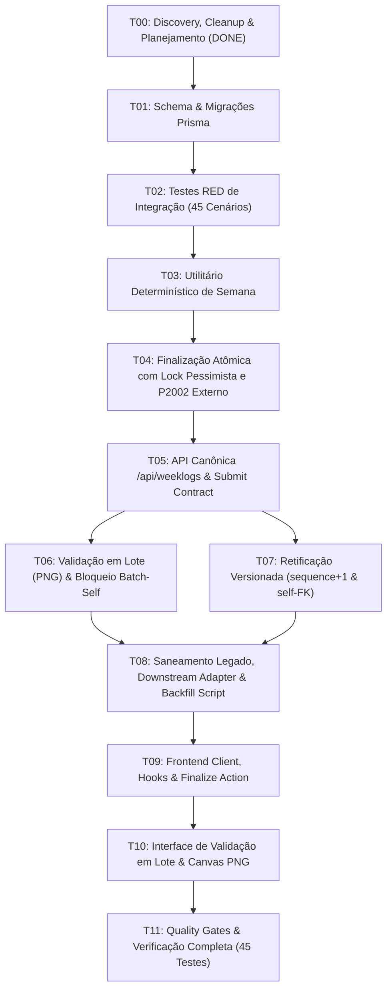

# Plano de Tarefas de Implementação — Spec 003: Conclusão de OP, WEEKLOG, Validação em Lote e Retificação Versionada (Revisão Pós-Remediação Final)

**Status da Rodada**: Final Human Re-Review Cleanup Concluído  
**Status da Spec**: SPEC 003 READY FOR IMPLEMENTATION  
**Branch**: `feat/003-production-weeklog`  
**Base**: `develop/operix-core`  
**Data**: 2026-09-17  
**Total de Cenários de Teste**: 45 testes de integração automatizados  

---

## 1. Tabela de Tarefas e Progresso

| Tarefa | Descrição Técnica | Status | Critério de Aceite / DoD |
|---|---|:---:|---|
| **T00** | **Discovery, Domain Analysis, Baseline Verification & Final Human Cleanup** | `DONE` | Mapeamento brownfield completo, resolução integral das 13 solicitações do Final Human Re-Review, sincronização completa de `ADR-003`, `findings.md`, `decisions.md`, `spec.md`, `acceptance.md` (45 cenários), `plan.md` e `tasks.md`. |
| **T01** | **Database Schema & Versioned Migration** | `DONE` | Adição de `Workspace.timezone`, `ClientAccessGrant` (com ciclo de vida: `status`, `grantedAt`, `revokedAt`, `revokedBy` e composite FK com `Client`), `ProductionOrder` (`executionSequence`, `operationalSiteKey`, `currencyCode`, `performedServices` e `rectificationOriginId`), `Weeklog` (`status: open/pending_validation/validated/rectification_pending`), `WeeklogEntry` (`executionSequence`, `legacyServiceOrderId`, `currencyCode` sem default EUR e `totalAmount`), e `WeeklogValidation` versionado (`validationSequence`, `coverageSnapshot`). Constraints `@@unique([productionOrderId, executionSequence])` e `@@unique([weeklogId, validationSequence])`. Migration canônica aplicada com zero drift. |
| **T02** | **Test-First Suite (RED Invariants — 45 Cenários)** | `DONE` | Implementação de `tests/integration/weeklog-operational-flow.test.ts` cobrindo todos os **45 cenários BDD**: finalização atômica, idempotência, concorrência real (`Promise.all`), retificação na mesma semana (sequence 2), retificação em semanas subsequentes, cadeias múltiplas de self-FK, segregação por cliente e local operacional, virada de DST, fallback de timezone, bloqueio estrito de auto-validação individual e em lote (`VALIDATOR-BATCH-SELF-01`), grants revogados (`VALIDATOR-REVOKED-01`), OPs diretas estruturadas com site e moeda obrigatórios (`DIRECT-OP-NO-SITE-01`, `FINALIZE-NO-CURRENCY-01`), submissão de lote (`SUBMIT-VALIDATION-01`, `SUBMIT-VALIDATION-IDEMPOTENT-01`), delegação de PATCH legado e imutabilidade de assinatura pós-validação. Suíte estrutural verde (5 testes) e baseline comportamental vermelho (45 testes) estabelecido sem implementação de produto. |
| **T03** | **Deterministic Week Calculation with Timezone** | `DONE` | Refatoração de `backend/src/lib/weekUtils.ts` com suporte a fuso horário IANA (Intl standard) para cálculo semanal determinístico (Domingo 00:00:00 a Sábado 23:59:59 local convertido para UTC) respeitando `Workspace.timezone` (fallback universal `"UTC"`), convertendo timestamps para UTC com tratamento exato de viradas de ano e transições de DST (167h primavera, 169h outono). Os 5 testes temporais foram aprovados (10 GREEN: 5 estruturais + 5 temporais; 40 RED comportamentais mantidos). |
| **T04** | **Atomic Finalization Service & Endpoint** | `DONE` | Implementação canônica de `finalizeProductionOrder` em `weeklogService.ts` com `SELECT ... FOR UPDATE` tenant-safe, validação estrita de pré-condições (422 para client, siteKey, currencyCode e performedServices), snapshot congelado em `WeeklogEntry`, upsert de `Weeklog` por unique composta, Downstream Legacy Projection Adapter em `service_orders`, link relacional de fotos/pastas sem duplicar bytes e tratamento seguro de `P2002` fora da transação abortada. Exposição de `POST /api/production-orders/:id/finalize` e delegação de `PATCH` legado. Todos os 14 cenários originais de finalização + 6 novos testes de invariantes (rollback, isolamento cross-tenant, tech own, header race, P2002 não relacionado e decimal exato) aprovados com sucesso. |
| **T05** | **Authoritative Weeklog REST API & Submit Contract** | `TODO` | Criação de `backend/src/routes/weeklogs.ts` com `GET /api/weeklogs`, `GET /api/weeklogs/:id`, `GET /api/weeklogs/:id/entries/:entryId` e `POST /api/weeklogs/:id/submit-for-validation` (congelando `coverageSnapshot` da rodada). Protegidos por `RequestContext` com filtro `scope: own` para técnicos. |
| **T06** | **Batch Validation & Governed Signature Storage (PNG Only)** | `TODO` | Implementação de `POST /api/weeklogs/:id/signature-upload` (staging MinIO estritamente PNG, validação de magic bytes `89 50 4E 47`, limite 1 MB; SVGs rejeitados) e `POST /api/weeklogs/:id/validate` (criação de `WeeklogValidation` versionado sequence+1, bloqueio estrito de auto-validação em lote se ator executou qualquer item da coverage, movimentação da assinatura para caminho canônico e bloqueio de edição in-place). |
| **T07** | **Versioned Rectification & Order Reopening** | `TODO` | Implementação de `POST /api/weeklogs/:id/entries/:entryId/rectify`, reabrindo a `ProductionOrder` para `in_production` com `executionSequence = sequence + 1`, apontando `rectificationOriginId`, status `rectification_pending` no lote e na entrada, preservando a entrada original intacta e aplicando regras TECH-ASSIGN para técnico indicado. |
| **T08** | **Sanitize Legacy ServiceOrders, Downstream Legacy Projection Adapter & Backfill Script** | `TODO` | Refatoração de `backend/src/routes/serviceOrders.ts` aplicando `RequestContext`, eliminando mutações em `GET`, removendo geração de `PaymentOrder` na validação e delegando `PATCH /production-orders/:id` com `status: delivered` diretamente para `finalizeProductionOrder`. Implementação do script de backfill não-destrutivo `scripts/backfill-legacy-service-orders.ts` (idempotente, com flag `--dry-run`, relatório detalhado de mapeados/não-mapeados, sem overwrite de `service_orders` e documentação de rollback). |
| **T09** | **Frontend API Client, Hooks & Finalize Action** | `TODO` | Criação de `src/lib/apiWeeklogs.ts`, hooks `useWeeklogs` (TanStack Query) e botão de ação para finalizar ordem de produção em `OrderDetailDialog.tsx` com validação prévia de cliente, local operacional e serviços estruturados. |
| **T10** | **Frontend Validation Screen with Canvas (PNG) & Rectification UI** | `TODO` | Implementação de tela/diálogo de validação do lote com botão de submissão (`submitForValidation`), canvas HTML5 para captura de assinatura manuscrita (PNG exclusivo), confirmação autenticada, inspeção individual de itens, fluxo de retificação com justificativa obrigatória e bloqueio de inputs em registros validados. |
| **T11** | **Quality Gates, Full Typecheck & Verification** | `TODO` | Execução dos gates de qualidade: todos os 45 testes de integração verdes, `npm run typecheck` (0 erros), `npm --prefix backend run typecheck` (0 erros), `npm run lint` (0 novos erros) e `npm run build` (0 erros). |

---

## 2. Dependências e Paralelismo

---

## 3. Critérios de Conclusão da Fase Atual

- [x] O código de produto **NÃO** foi alterado.
- [x] Nenhuma migração foi executada ou gerada nesta rodada.
- [x] O `schema.prisma` permanece intocado.
- [x] Todos os 13 pontos do Final Human Re-Review Cleanup foram integralmente resolvidos nos artefatos.
- [x] Os 45 cenários de aceitação estão rigorosamente sincronizados entre `acceptance.md`, `spec.md`, `plan.md` e `tasks.md`.
- [x] Status do entregável: **SPEC 003 READY FOR IMPLEMENTATION**.
