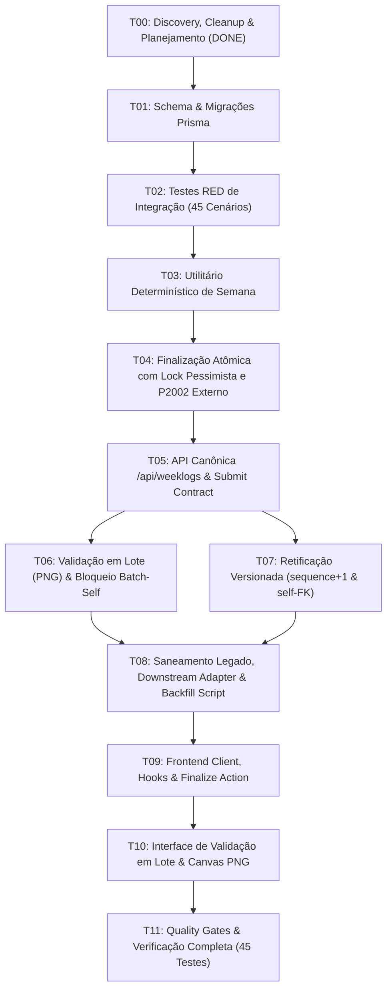

# Plano de Tarefas de Implementação — Spec 003: Conclusão de OP, WEEKLOG, Validação em Lote e Retificação Versionada (Revisão Pós-Remediação Final)

**Status da Rodada**: Final Human Re-Review Cleanup Concluído  
**Status da Spec**: SPEC 003 READY FOR IMPLEMENTATION  
**Branch**: `feat/003-production-weeklog`  
**Base**: `develop/operix-core`  
**Data**: 2026-09-17  
**Total de Cenários de Teste**: 89 cenários de aceitação formal (+ 5 testes estruturais = 94 testes de integração no total; 94 GREEN / 0 RED)  

---

## 1. Tabela de Tarefas e Progresso

| Tarefa | Descrição Técnica | Status | Critério de Aceite / DoD |
|---|---|:---:|---|
| **T00** | **Discovery, Domain Analysis, Baseline Verification & Final Human Cleanup** | `DONE` | Mapeamento brownfield completo, resolução integral das 13 solicitações do Final Human Re-Review, sincronização completa de `ADR-003`, `findings.md`, `decisions.md`, `spec.md`, `acceptance.md` (45 cenários originais), `plan.md` e `tasks.md`. |
| **T01** | **Database Schema & Versioned Migration** | `DONE` | Adição de `Workspace.timezone`, `ClientAccessGrant` (com ciclo de vida: `status`, `grantedAt`, `revokedAt`, `revokedBy` e composite FK com `Client`), `ProductionOrder` (`executionSequence`, `operationalSiteKey`, `currencyCode`, `performedServices` e `rectificationOriginId`), `Weeklog` (`status: open/pending_validation/validated/rectification_pending`), `WeeklogEntry` (`executionSequence`, `legacyServiceOrderId`, `currencyCode` sem default EUR e `totalAmount`), e `WeeklogValidation` versionado (`validationSequence`, `coverageSnapshot`). Constraints `@@unique([productionOrderId, executionSequence])` e `@@unique([weeklogId, validationSequence])`. Migration canônica aplicada com zero drift. |
| **T02** | **Test-First Suite (RED Invariants — Baseline Inicial)** | `DONE` | Implementação de `tests/integration/weeklog-operational-flow.test.ts` cobrindo cenários BDD originais. Suíte estrutural verde (5 testes) e baseline comportamental vermelho estabelecido sem implementação de produto. |
| **T03** | **Deterministic Week Calculation with Timezone** | `DONE` | Refatoração de `backend/src/lib/weekUtils.ts` com suporte a fuso horário IANA (Intl standard) para cálculo semanal determinístico (Domingo 00:00:00 a Sábado 23:59:59 local convertido para UTC) respeitando `Workspace.timezone` (fallback universal `"UTC"`), convertendo timestamps para UTC com tratamento exato de viradas de ano e transições de DST (167h primavera, 169h outono). Os 5 testes temporais foram aprovados (10 GREEN: 5 estruturais + 5 temporais; 40 RED comportamentais mantidos). |
| **T04** | **Atomic Finalization Service & Endpoint (+ Hardening)** | `DONE` | Implementação canônica de `finalizeProductionOrder` em `weeklogService.ts` com `SELECT ... FOR UPDATE` tenant-safe, validação estrita de pré-condições (422 para client, siteKey, currencyCode e performedServices), snapshot congelado em `WeeklogEntry`, upsert de `Weeklog` por unique composta, Downstream Legacy Projection Adapter em `service_orders`, link relacional de fotos/pastas sem duplicar bytes e tratamento seguro de `P2002` fora da transação abortada. Exposição de `POST /api/production-orders/:id/finalize` e delegação de `PATCH` legado. Todos os 14 cenários originais de finalização + 11 novos testes de invariantes e hardening aprovados com sucesso. |
| **T05** | **Authoritative Weeklog REST API, Submit Contract & T05 Hardening** | `DONE` | Migration mínima `20260917110000` expandindo `WeeklogValidation` com ciclo de vida de rodada e migration corretiva forward-only `20260917120000` preservando histórico pré-T05 (status `validated`, `submitted_at` nullable sem default, `submitted_by: null`, zero fabricação de auditoria). Endpoints `GET /api/weeklogs`, `GET /api/weeklogs/:id`, `GET /api/weeklogs/:id/entries`, `GET /api/weeklogs/:id/entries/:entryId` e `POST /api/weeklogs/:id/submit-for-validation`. Isolamento estrito de tenant (`RequestContext`), visibilidade restrita de técnico (`scope: own`), autoridade de submissão restrita a gestores/owners (bloqueio 403 de técnico), transição com lock pessimista (`SELECT ... FOR UPDATE`), retry idempotente na mesma rodada (HTTP 200), bloqueio de estados indevidos (HTTP 409), autoria auditada server-side (`SUBMIT-AUDIT-ACTOR-01`), imutabilidade estrita de `coverageSnapshot` no banco (`SUBMIT-COVERAGE-DB-IMMUTABLE-01`) e pureza total de requisições GET (zero escritas). Teste de upgrade com dados legados e clean DB com zero drift. 52 testes GREEN (5 estruturais + 47 de aceitação) e exatamente 20 RED reservados para T06/T07. |
| **T06** | **Batch Validation & Governed Signature Storage (+ Targeted Hardening)** | `DONE` | Implementação de `POST /api/weeklogs/:id/entries/:entryId/review` (revisão individual com bloqueio de auto-revisão), autoridade de validador via `ClientAccessGrant` ativo (`SELECT ... FOR UPDATE`), `POST /api/weeklogs/:id/signature-upload` (staging MinIO estritamente PNG, magic bytes `89 50 4E 47 0D 0A 1A 0A`, limite 1 MB), `POST /api/weeklogs/:id/validate` (completa a MESMA Validation Round com status `validated`, promoção determinística fora da transação do banco, e limpeza best-effort do staging), isolamento da transação sem I/O de storage (`SIGNATURE-DB-COMMIT-FAILURE-01`), arquitetura de Storage Driver sem fallback silencioso em produção (`SIGNATURE-STORAGE-UNAVAILABLE-01`), bloqueio estrito de auto-validação em lote (`VALIDATOR-BATCH-SELF-01`), concorrência real na revogação de grant com lock pessimista (`VALIDATOR-GRANT-REVOKE-RACE-01`), remoção de rotas artificiais de PATCH, imutabilidade pós-validação (409 Conflict) e zero efeitos financeiros colaterais. 79 testes GREEN / 6 RED estritamente reservados para T07. |
| **T07** | **Versioned Rectification & Order Reopening** | `DONE` | Implementação de `POST /api/weeklogs/:id/entries/:entryId/rectify` e `rectifyWeeklogEntry` com transação atômica única, ordem determinística de locks (`Weeklog` $\rightarrow$ `WeeklogEntry` $\rightarrow$ `ProductionOrder`), validação rigorosa de motivo obrigatório, integridade de tenant/parent e autoridade do chamador. Bloqueio de validador externo de escolher técnico (TECH-ASSIGN), preservação de integridade de linhagem (rejeição de retificação stale 409), reabertura atômica de `ProductionOrder` para `in_production` com `executionSequence = entry.executionSequence + 1` e `rectificationOriginId = entry.id`. Idempotência semântica e concorrência real validadas com `Promise.all`. Imutabilidade estrita de snapshots históricos da entrada original, preservação de Validation Rounds anteriores e zero efeitos colaterais financeiros. 94 testes GREEN (89 aceitação formal + 5 estruturais; 100% de aprovação). |
| **T08** | **Sanitize Legacy ServiceOrders, Downstream Legacy Projection Adapter & Backfill Script** | `TODO` | Refatoração de `backend/src/routes/serviceOrders.ts` aplicando `RequestContext`, eliminando mutações em `GET`, removendo geração de `PaymentOrder` na validação e delegando `PATCH /production-orders/:id` com `status: delivered` diretamente para `finalizeProductionOrder`. Implementação do script de backfill não-destrutivo `scripts/backfill-legacy-service-orders.ts` (idempotente, com flag `--dry-run`, relatório detalhado de mapeados/não-mapeados, sem overwrite de `service_orders` e documentação de rollback). |
| **T09** | **Frontend API Client, Hooks & Finalize Action** | `TODO` | Criação de `src/lib/apiWeeklogs.ts`, hooks `useWeeklogs` (TanStack Query) e botão de ação para finalizar ordem de produção em `OrderDetailDialog.tsx` com validação prévia de cliente, local operacional e serviços estruturados. |
| **T10** | **Frontend Validation Screen with Canvas (PNG) & Rectification UI** | `TODO` | Implementação de tela/diálogo de validação do lote com botão de submissão (`submitForValidation`), canvas HTML5 para captura de assinatura manuscrita (PNG exclusivo), confirmação autenticada, inspeção individual de itens, fluxo de retificação com justificativa obrigatória e bloqueio de inputs em registros validados. |
| **T11** | **Quality Gates, Full Typecheck & Verification** | `TODO` | Execução dos gates de qualidade: todos os 67 testes de aceitação comportamental + 5 estruturais (72 total) verdes, `npm run typecheck` (0 erros), `npm --prefix backend run typecheck` (0 erros), `npm run lint` (0 novos erros) e `npm run build` (0 erros). |

---

## 2. Dependências e Paralelismo

---

## 3. Critérios de Conclusão da Fase Atual

- [x] O código de produto **NÃO** foi alterado.
- [x] Nenhuma migração foi executada ou gerada nesta rodada.
- [x] O `schema.prisma` permanece intocado.
- [x] Todos os 13 pontos do Final Human Re-Review Cleanup foram integralmente resolvidos nos artefatos.
- [x] Os 45 cenários de aceitação estão rigorosamente sincronizados entre `acceptance.md`, `spec.md`, `plan.md` e `tasks.md`.
- [x] Status do entregável: **SPEC 003 READY FOR IMPLEMENTATION**.
