# Spec 004 — Payment List, External Imports & Commercial Confrontation (Hardening Final Pré-Test-First)

**Status**: Engineering Complete — Handoff Ready for Spec 005
**Prioridade**: P1 (Core Comercial e Operacional)  
**Fase de Engenharia**: R2 — Lista, Confronto e Financeiro Essencial  
**Data**: 2026-09-18 (Hardening Final Pré-Test-First)  
**Branch de Trabalho**: `feat/004-payment-list-confrontation`  
**Base de Integração**: `develop/operix-core` (com Specs 001, 002 e 003 consolidadas)  

---

## 1. Contexto e Problema

No ecossistema Operix, o ciclo operacional móvel consolida os serviços executados em oficina ou em campo através do **WEEKLOG semanal** (estabilizado na Spec 003). Contudo, a relação comercial com grandes clientes (frotistas, seguradoras, plataformas de granizo e desamassamento PDR) obedece a uma dinâmica financeira distinta:
1. **Diferença Temporal e Multissemanal**: O cliente não efetua o pagamento atrelado à semana física de produção da oficina. O cliente audita o trabalho realizado e emite ou recebe uma **Lista de Pagamento (*PaymentList*)** consolidada, que frequentemente agrupa veículos de **múltiplas semanas operacionais distintas** (ex.: semanas W29, W30, W31 e W32 na mesma folha de faturamento).
2. **Importação Externa de Documentos (Planilhas e OCR)**: Muitas oficinas parceiras e clientes enviam listas em PDF ou imagens escaneadas. O sistema precisa suportar upload governado no MinIO, extração via IA/OCR com preservação fiel do texto monetário bruto (`rawTotalText`), persistência em staging relacional editável (`ExternalListImport` e `ExternalListImportItem`) e revisão humana rigorosa com campos obrigatórios validados antes de qualquer efetivação.
3. **O Confronto Comercial (*Commercial Confrontation*) Versionado**: É imperativo comparar item a item o que a oficina declarou ter executado (**WEEKLOGs validados**) contra o que o cliente reconheceu e auditou (**Lista do Cliente**), agrupando execuções em rodadas versionadas (`PaymentListConfrontationRun`), identificando divergências da tríade (veículo, serviço, valor) e persistindo o pareamento em `PaymentListConfrontationResult`. Decisões humanas registradas tornam a rodada imutável contra sobrescritas acidentais de reruns.
4. **Fronteira Financeira Estrita**: A Lista de Pagamento nos status comerciais `pending` e `paid` atua como a fonte primária de verdade para as fórmulas financeiras canônicas da Spec 005:
   $$\begin{aligned}
   \text{Reconhecido} &= \sum \text{Lista de Pagamento (recognizedTotal)} \\
   \text{Esperado}    &= \sum \text{Lista de Pagamento em status 'pending'} \\
   \text{Recebido}    &= \sum \text{Lista de Pagamento em status 'paid'}
   \end{aligned}$$
   A liquidação comercial (`status = 'paid'`) é prerrogativa exclusiva de gestores (`owner`/`admin`), opera de forma idempotente e possui **zero efeitos contábeis em `financial_records`**, sem cálculo antecipado de repasse ou comissões.

---

## 2. Atores do Sistema e Matriz de Autorização

| Ator | Papel no Contexto | Visibilidade de Lista | Ações Permitidas | Restrições Invioláveis |
| :--- | :--- | :--- | :--- | :--- |
| **Técnico Vinculado** | `technician` (`scope: own`) | Visualiza **apenas** as linhas de serviços de sua autoria nas listas | Leitura de seus itens e status comercial aplicável | Proibido visualizar faturamento total da empresa, margem ou serviços de colegas. Zero fórmulas de repasse antecipadas nesta spec |
| **Técnico Independente** | `owner` no Personal Workspace | Visualiza suas próprias listas completas | Ciclo completo: importação, conferência, confronto e liquidação | Restrito estritamente aos seus dados pessoais |
| **Owner / Administrador** | `owner` ou `admin` do Workspace | Visibilidade completa de todas as listas e itens do tenant | Criar listas, importar OCR, executar confronto, aceitar divergências, transicionar status até `paid` | Proibido acesso a outros workspaces de terceiros |

> [!NOTE]
> **Decisão de Escopo de Validação de Lista**: Validadores externos com `ClientAccessGrant` possuem autoridade restrita à conferência física do lote semanal de WEEKLOG (Spec 003). A validação comercial da `PaymentList` no sistema é uma atribuição exclusiva de administradores internos (`owner` e `admin`), com base no documento físico/PDF auditado recebido do cliente.

---

## 3. Current State vs. Target State

```mermaid
flowchart TD
    subgraph CurrentState["Estado Atual Legado (Inseguro e Desacoplado)"]
        EX0["Upload Base64 Efêmero\nPOST /api/extract/payment-order"] -->|Sem MinIO / Sem Staging| OCR0["Retorna JSON para memória da UI"]
        UI0["PaymentOrdersPage.tsx\n(Estado em Memória React)"] -->|Salvar Manual| PO0["Insere linhas em payment_orders\n(list_name texto solto)"]
        REC0["Reconciliação Legada\nPOST /finance/reconciliations/run"] -->|HARD RESET GLOBAL| DEL0["deleteMany({matchedBy: 'auto'})\nApaga dados de todos os tenants!"]
        VAL0["POST /finance/confrontation/validate"] -->|Side Effect Automático| FIN0["Cria financial_records sem workspaceId"]
        UI1["PaymentOrdersTable.tsx"] -->|Supabase Client Direto| MUT0["Muta payment_orders.amount_paid no cliente"]
    end

    subgraph TargetState["Estado Alvo Canônico (Spec 004 Hardened)"]
        UP["Upload Original no MinIO\ntenants/{ws}/lists/imports/{id}"] --> STG["Staging Relacional com Proveniência\n(ExternalListImport + ExternalListImportItem)\nPreserva rawTotalText"]
        STG --> REV["Revisão Humana Guiada Linha a Linha na UI\n(Campos obrigatórios sem defaults silenciosos)"]
        REV --> COMMIT["Efetivação: Alocação Atômica L0xxxxx (CLI Seed Discovery)\nCabeçalho PaymentList + Itens PaymentListItem"]
        COMMIT --> CLAIM["Criação de Claims Semânticos:\nPaymentListEntryClaim (status = 'reserved')"]
        COMMIT --> CONF["Motor de Confronto Comercial Versionado\nRodadas: PaymentListConfrontationRun (sequence 1, 2...)"]
        CONF --> RESULT["Resultados Desacoplados e Chaves Compostas:\nPaymentListConfrontationResult (Default: 'not_evaluated')"]
        RESULT -->|Tríade: Veículo + Serviço + Valor| DEC["Decisão Humana Obrigatória\n(Accept / Contest / Rectify / Reject)"]
        DEC -->|Disputas Abertas Bloqueiam 'pending'| TRANS["Transição Estrita: draft → under_review → confronted → pending → paid"]
        TRANS -->|pending avança| CONSUME["Claims Transicionam para 'consumed'\n(Zero Double-Billing Permanente)"]
        TRANS --> FIN1["Fronteira Financeira Canônica:\nstatus 'pending' (Esperado) / status 'paid' (Recebido)\nZERO Mutações em financial_records"]
        COMMIT -.->|Downstream One-Way Adapter| LEG["Projeção Legada payment_orders (Somente-Leitura)"]
    end
```



---

## 4. Invariantes de Domínio e Segurança

- **INV-001 (RequestContext e Isolamento Estrito)**: 100% dos endpoints de Lista, Importação e Confronto exigem `requireAuth` + `resolveRequestContext` e aplicam `assertTenantAccess(ctx, resource.workspaceId)` deny-by-default (*CWE-639 / OWASP API1*).
- **INV-002 (Consumo Exclusivo de WEEKLOG Validado)**: O Confronto Comercial consome exclusivamente `WeeklogEntry` validadas (`validationStatus: "approved"` dentro de lote com `status: "validated"`). Entradas em aberto ou sob retificação são inelegíveis para o confronto.
- **INV-003 (Imutabilidade do Histórico de WEEKLOG)**: A criação, importação ou validação de uma Lista **nunca altera** dados do cabeçalho `Weeklog`, snapshots de cobertura da validação ou assinaturas de lotes da Spec 003.
- **INV-004 (Anti-Double-Billing Estrutural via Claims Semânticos)**: Uma `WeeklogEntry` só pode possuir um único claim não-liberado simultaneamente. A unicidade é garantida via partial unique index no PostgreSQL:
  ```sql
  CREATE UNIQUE INDEX unique_active_or_consumed_weeklog_entry_claim
  ON payment_list_entry_claims (workspace_id, weeklog_entry_id)
  WHERE status IN ('reserved', 'consumed');
  ```
  Ao avançar para `pending`, as claims de itens aceitos transicionam para `consumed`, tornando-se permanentemente imutáveis. O cancelamento da lista reverte claims `reserved` para `released`.
- **INV-005 (Suporte Multissemanas Autoritativo)**: Uma `PaymentList` pode agrupar trabalhos executados em múltiplas semanas distintas para o mesmo `clientId`, desde que pertençam ao mesmo workspace.
- **INV-006 (Moeda Canônica Obrigatória Sem Defaults)**: Cada `PaymentList` exige `currencyCode` formado estritamente por 3 letras ASCII maiúsculas (`^[A-Z]{3}$`, not null, sem default). A ausência retorna HTTP 422 `CURRENCY_REQUIRED`. Uma lista é estritamente single-currency; itens com moeda divergente retornam HTTP 422 `CURRENCY_MISMATCH`.
- **INV-007 (Numeração Monotônica L0xxxxx com Seed Determinístico)**: A numeração segue estritamente `L` seguido de 6 dígitos decimais (`L000001`..`L999999`), escopada por tenant. O seed discovery é executado via script seguro (default DRY-RUN), considerando apenas registros com `workspaceId` comprovado.
- **INV-008 (Revisão Humana Mandatória em Staging Relacional)**: Nenhum dado extraído via IA/OCR pode gerar `PaymentList` ou `PaymentListItem` sem revisão humana e confirmação explícita de commit no staging relacional.
- **INV-009 (Zero Efeitos Financeiros Automáticos)**: O confronto comercial não cria registros em `financial_records`, não debita despesas e não antecipa lançamentos de caixa. Tais efeitos pertencem estritamente à Spec 005.
- **INV-010 (Escopo Estrito de Técnico / Ocultação de Faturamento)**: Técnicos vinculados (`scope: own`) recebem dados sanitizados server-side, com visibilidade restrita aos seus próprios serviços reconhecidos, sem acesso ao faturamento total da empresa e sem fórmulas de rateio antecipadas.
- **INV-011 (Linhagem de Retificação Originada na Lista)**: Quando uma divergência comercial decorre de vício técnico (glosa por trabalho malfeito), a ação `REQUEST_RECTIFICATION` invoca o comando canônico da Spec 003, reabrindo a `ProductionOrder` com `executionSequence + 1` e registrando os identificadores de linhagem em `PaymentListConfrontationResult`.
- **INV-012 (Governança de Documento Original MinIO)**: Arquivos de lista importados são persistidos sob a convenção segura de paths do MinIO com cálculo de SHA-256 e proveniência auditável.
- **INV-013 (XOR Estrutural para WEEKLOG Externo)**: Na tabela `WeeklogEntry`, entradas externas utilizam discriminador explícito `sourceType = 'external_import'` e `externalImportItemId` (com `productionOrderId: null`), governadas por constraint CHECK XOR no PostgreSQL.
- **INV-014 (Validação Auditável de WEEKLOG Externo)**: A confirmação humana de importação de WEEKLOG externo gera uma rodada formal em `WeeklogValidation` com `validationMethod = "external_import_review"`, garantindo conformidade sem inventar assinaturas falsas.
- **INV-015 (Bloqueio de Pending por Disputas Abertas)**: Uma `PaymentList` não pode transicionar para `pending` se houver itens com decisões em aberto (`CONTEST` ou `REQUEST_RECTIFICATION`).
- **INV-016 (Versionamento e Idempotência de Execuções de Confronto)**: Cada execução do motor de confronto gera uma rodada versionada `PaymentListConfrontationRun`. Se a rodada ativa possuir decisões humanas registradas, novos confrontos automáticos são bloqueados (HTTP 409 `CONFRONTATION_RERUN_HAS_DECISIONS`), protegendo o trabalho de auditoria.
- **INV-017 (Unicidade de Pareamento dentro da Rodada)**: Dentro de uma mesma rodada de confronto (`runId`), um `PaymentListItem` não pode ser confrontado mais de uma vez, e uma `WeeklogEntry` não pode ser associada a múltiplos itens como match exato. Ambiguidade exige resolução humana.
- **INV-018 (Snapshot Congelado de Cobertura de WEEKLOG Externo)**: A validação formal de importação externa registra em `coverageSnapshot` o schema completo com array de entradas aprovadas, `sourceImportId` e `sha256`. Nenhuma entrada inserida a posteriori herda essa validação.
- **INV-019 (Unicidade Estrutural de Fonte Externa)**: Um `ExternalOperationalImportItem` só pode materializar uma única `WeeklogEntry` (`UNIQUE(external_import_item_id)`). Retries de commit são rigorosamente idempotentes.
- **INV-020 (Autoridade e Idempotência da Liquidação)**: A transição para `paid` é restrita a usuários `owner` e `admin`, opera de forma idempotente e não produz side-effects contábeis.
- **INV-021 (Proveniência de Storage sem Chaves Fictícias)**: Antes da promoção física, `storagePath`, hash, MIME e tamanho podem ser `NULL`; após promoção bem-sucedida, o serviço T05 deve persistir os quatro valores derivados do objeto real. `failed` nunca recebe path sentinela.
- **INV-022 (Authority Revisada de Staging)**: `ExternalListImport` concentra cliente e moeda revisados para a lista single-client/single-currency. `ExternalOperationalImportItem` preserva raw separado de authority revisada, incluindo cliente, moeda, site, técnico, veículo, serviços, total e `reviewedDeliveredAt`; somente o serviço T05 pode exigir esses campos antes de `reviewed` ou materialização.

---

## 5. Especificação Canônica de Dados e Relacionamentos (DDL Target)

```prisma
// ---------------------------------------------------------------------------
// Spec 004 — Domínio Canônico de Lista de Pagamento, Importação e Confronto
// ---------------------------------------------------------------------------

enum PaymentListStatus {
  draft
  under_review
  confronted
  pending
  paid
  cancelled
}

enum ConfrontationStatus {
  not_evaluated
  exact_match
  ambiguous_match
  value_difference
  service_discrepancy
  vehicle_not_found
  unmatched_weeklog
}

enum ConfrontationDecision {
  none
  accept_difference
  contest
  request_rectification
  reject_item
}

enum ImportStatus {
  uploaded
  extracting
  extracted
  under_review
  reviewed
  committed
  failed
  discarded
}

model PaymentList {
  id                  String            @id @default(uuid())
  workspaceId         String            @map("workspace_id")
  listNumber          String            @map("list_number") // ex: "L000143"
  clientId            String            @map("client_id")
  clientName          String            @map("client_name")
  currencyCode        String            @map("currency_code") // ISO-4217, exatamente 3 letras maiúsculas, sem default
  status              PaymentListStatus @default(draft)
  
  // Totalizadores Canônicos Auditáveis
  itemCount           Int               @default(0) @map("item_count")
  sourceDocumentTotal Decimal           @default(0.00) @map("source_document_total") @db.Decimal(12, 2)
  recognizedTotal     Decimal           @default(0.00) @map("recognized_total") @db.Decimal(12, 2)
  
  // Metadados e Vínculos Estruturais
  issueDate           DateTime?         @map("issue_date")
  dueDate             DateTime?         @map("due_date")
  paidAt              DateTime?         @map("paid_at")
  paidBy              String?           @map("paid_by")
  documentId          String?           @map("document_id")
  invoiceId           String?           @map("invoice_id")
  notes               String?
  
  // Auditoria
  createdBy           String            @map("created_by")
  confrontedBy        String?           @map("confronted_by")
  confrontedAt        DateTime?         @map("confronted_at")
  validatedBy         String?           @map("validated_by")
  validatedAt         DateTime?         @map("validated_at")
  createdAt           DateTime          @default(now()) @map("created_at")
  updatedAt           DateTime          @updatedAt @map("updated_at")

  // Relacionamentos com integridade de tenant
  workspace           Workspace         @relation(fields: [workspaceId], references: [id], onDelete: Cascade)
  client              Client            @relation(fields: [clientId, workspaceId], references: [id, workspaceId], onDelete: Restrict)
  items               PaymentListItem[]
  claims              PaymentListEntryClaim[]
  confrontationRuns   PaymentListConfrontationRun[]
  confrontationResults PaymentListConfrontationResult[]
  externalImports     ExternalListImport[]

  @@unique([id, workspaceId])
  @@unique([workspaceId, listNumber])
  @@index([workspaceId, status])
  @@index([clientId, status])
  @@map("payment_lists")
}

model PaymentListItem {
  id                    String                @id @default(uuid())
  workspaceId           String                @map("workspace_id")
  paymentListId         String                @map("payment_list_id")
  
  // Vínculo Canônico com a Execução Física Original
  weeklogEntryId        String?               @map("weeklog_entry_id")
  legacyPaymentOrderId  String?               @map("legacy_payment_order_id")
  
  // Identificação do Veículo Declarada pelo Cliente
  carName               String?               @map("car_name")
  licensePlate          String?               @map("license_plate")
  vin                   String?               @map("vin")
  
  // Atribuição Operacional
  technicianUserId      String?               @map("technician_user_id")
  technicianName        String?               @map("technician_name")
  operationalSiteKey    String?               @map("operational_site_key")
  
  // Serviços e Valores Declarados
  servicesSnapshot      Json                  @map("services_snapshot")
  totalAmount           Decimal               @map("total_amount") @db.Decimal(12, 2)
  
  createdAt             DateTime              @default(now()) @map("created_at")
  updatedAt             DateTime              @updatedAt @map("updated_at")

  paymentList           PaymentList           @relation(fields: [paymentListId, workspaceId], references: [id, workspaceId], onDelete: Cascade)
  weeklogEntry          WeeklogEntry?         @relation(fields: [weeklogEntryId, workspaceId], references: [id, workspaceId], onDelete: Restrict)
  confrontationResults  PaymentListConfrontationResult[]

  @@unique([id, workspaceId])
  @@unique([id, paymentListId, workspaceId])
  @@index([workspaceId, paymentListId])
  @@index([weeklogEntryId])
  @@map("payment_list_items")
}

model PaymentListEntryClaim {
  id              String       @id @default(uuid())
  workspaceId     String       @map("workspace_id")
  paymentListId   String       @map("payment_list_id")
  weeklogEntryId  String       @map("weeklog_entry_id")
  status          String       @default("reserved") // "reserved" | "consumed" | "released"
  claimedAt       DateTime     @default(now()) @map("claimed_at")
  consumedAt      DateTime?    @map("consumed_at")
  releasedAt      DateTime?    @map("released_at")
  releasedReason  String?      @map("released_reason")

  workspace       Workspace    @relation(fields: [workspaceId], references: [id], onDelete: Cascade)
  paymentList     PaymentList  @relation(fields: [paymentListId, workspaceId], references: [id, workspaceId], onDelete: Cascade)
  weeklogEntry    WeeklogEntry @relation(fields: [weeklogEntryId, workspaceId], references: [id, workspaceId], onDelete: Restrict)

  @@index([workspaceId, paymentListId])
  @@map("payment_list_entry_claims")
}

model PaymentListConfrontationRun {
  id            String   @id @default(uuid())
  workspaceId   String   @map("workspace_id")
  paymentListId String   @map("payment_list_id")
  sequence      Int      @default(1)
  status        String   @default("started") // started, completed, superseded
  startedAt     DateTime @default(now()) @map("started_at")
  completedAt   DateTime? @map("completed_at")

  workspace     Workspace   @relation(fields: [workspaceId], references: [id], onDelete: Cascade)
  paymentList   PaymentList @relation(fields: [paymentListId, workspaceId], references: [id, workspaceId], onDelete: Cascade)
  results       PaymentListConfrontationResult[]

  @@unique([paymentListId, sequence])
  @@unique([id, paymentListId, workspaceId])
  @@index([workspaceId, paymentListId])
  @@map("payment_list_confrontation_runs")
}

model PaymentListConfrontationResult {
  id                        String                      @id @default(uuid())
  workspaceId               String                      @map("workspace_id")
  paymentListId             String                      @map("payment_list_id")
  runId                     String                      @map("run_id")
  paymentListItemId         String?                     @map("payment_list_item_id")
  weeklogEntryId            String?                     @map("weeklog_entry_id")
  
  status                    ConfrontationStatus         @default(not_evaluated) @map("status")
  decision                  ConfrontationDecision       @default(none) @map("decision")
  differenceAmount          Decimal                     @default(0.00) @map("difference_amount") @db.Decimal(12, 2)
  notes                     String?
  
  // Auditoria da Decisão Humana
  decidedBy                 String?                     @map("decided_by")
  decidedAt                 DateTime?                   @map("decided_at")
  
  // Linhagem da Retificação (Spec 003)
  reopenedProductionOrderId String?                     @map("reopened_production_order_id")
  targetExecutionSequence   Int?                        @map("target_execution_sequence")

  createdAt                 DateTime                    @default(now()) @map("created_at")
  updatedAt                 DateTime                    @updatedAt @map("updated_at")

  workspace                 Workspace                   @relation(fields: [workspaceId], references: [id], onDelete: Cascade)
  paymentList               PaymentList                 @relation(fields: [paymentListId, workspaceId], references: [id, workspaceId], onDelete: Cascade)
  confrontationRun          PaymentListConfrontationRun @relation(fields: [runId, paymentListId, workspaceId], references: [id, paymentListId, workspaceId], onDelete: Cascade)
  paymentListItem           PaymentListItem?            @relation(fields: [paymentListItemId, paymentListId, workspaceId], references: [id, paymentListId, workspaceId], onDelete: Restrict)
  weeklogEntry              WeeklogEntry?               @relation(fields: [weeklogEntryId, workspaceId], references: [id, workspaceId], onDelete: Restrict)

  @@index([workspaceId, paymentListId])
  @@index([runId, paymentListId, workspaceId])
  @@index([weeklogEntryId])
  @@map("payment_list_confrontation_results")
}

model ExternalListImport {
  id                  String                  @id @default(uuid())
  workspaceId         String                  @map("workspace_id")
  paymentListId       String?                 @map("payment_list_id")
  fileName            String                  @map("file_name")
  storagePath         String?                 @map("storage_path")
  fileSha256          String?                 @map("file_sha256")
  mimeType            String?                 @map("mime_type")
  sizeBytes           Int?                    @map("size_bytes")
  reviewedClientId    String?                 @map("reviewed_client_id")
  reviewedCurrencyCode String?                @map("reviewed_currency_code")
  status              ImportStatus            @default(uploaded)
  rawOcrResult        Json?                   @map("raw_ocr_result")
  errorMessage        String?                 @map("error_message")
  uploadedBy          String                  @map("uploaded_by")
  createdAt           DateTime                @default(now()) @map("created_at")
  updatedAt           DateTime                @updatedAt @map("updated_at")

  workspace           Workspace               @relation(fields: [workspaceId], references: [id], onDelete: Cascade)
  paymentList         PaymentList?            @relation(fields: [paymentListId, workspaceId], references: [id, workspaceId], onDelete: Restrict)
  reviewedClient      Client?                 @relation("ExternalListImportReviewedClient", fields: [reviewedClientId, workspaceId], references: [id, workspaceId], onDelete: Restrict)
  items               ExternalListImportItem[]

  @@unique([id, workspaceId])
  @@index([workspaceId, status])
  @@map("external_list_imports")
}

model ExternalListImportItem {
  id                    String                  @id @default(uuid())
  workspaceId           String                  @map("workspace_id")
  importId              String                  @map("import_id")
  
  // Valores Brutos Extraídos (Texto exato preservado)
  rawLicensePlate       String?                 @map("raw_license_plate")
  rawVin                String?                 @map("raw_vin")
  rawCarName            String?                 @map("raw_car_name")
  rawClient             String?                 @map("raw_client")
  rawTechnician         String?                 @map("raw_technician")
  rawPlatform           String?                 @map("raw_platform")
  rawServices           Json?                   @map("raw_services")
  rawTotalText          String?                 @map("raw_total_text")
  fieldConfidence       Json?                   @map("field_confidence")
  
  // Valores Revisados pelo Operador
  reviewedLicensePlate  String?                 @map("reviewed_license_plate")
  reviewedVin           String?                 @map("reviewed_vin")
  reviewedCarName       String?                 @map("reviewed_car_name")
  reviewedTechnicianUserId String?              @map("reviewed_technician_user_id")
  reviewedServices      Json?                   @map("reviewed_services")
  reviewedTotal         Decimal?                @map("reviewed_total") @db.Decimal(12, 2)
  
  status                String                  @default("staged") // staged, reviewed, rejected
  reviewedBy            String?                 @map("reviewed_by")
  reviewedAt            DateTime?               @map("reviewed_at")

  import                ExternalListImport      @relation(fields: [importId, workspaceId], references: [id, workspaceId], onDelete: Cascade)

  @@index([workspaceId, importId])
  @@map("external_list_import_items")
}

model TenantSequenceCounter {
  id            String   @id @default(uuid())
  workspaceId   String   @map("workspace_id")
  sequenceType  String   @map("sequence_type") // "payment_list"
  currentValue  Int      @default(0) @map("current_value")
  updatedAt     DateTime @updatedAt @map("updated_at")

  workspace     Workspace @relation(fields: [workspaceId], references: [id], onDelete: Cascade)

  @@unique([workspaceId, sequenceType])
  @@map("tenant_sequence_counters")
}

model ExternalOperationalImport {
  id                  String                          @id @default(uuid())
  workspaceId         String                          @map("workspace_id")
  fileName            String                          @map("file_name")
  storagePath         String?                         @map("storage_path")
  fileSha256          String?                         @map("file_sha256")
  mimeType            String?                         @map("mime_type")
  sizeBytes           Int?                            @map("size_bytes")
  status              ImportStatus                    @default(uploaded)
  rawOcrResult        Json?                           @map("raw_ocr_result")
  errorMessage        String?                         @map("error_message")
  uploadedBy          String                          @map("uploaded_by")
  createdAt           DateTime                        @default(now()) @map("created_at")
  updatedAt           DateTime                        @updatedAt @map("updated_at")

  workspace           Workspace                       @relation(fields: [workspaceId], references: [id], onDelete: Cascade)
  items               ExternalOperationalImportItem[]

  @@unique([id, workspaceId])
  @@index([workspaceId, status])
  @@map("external_operational_imports")
}

model ExternalOperationalImportItem {
  id                    String                    @id @default(uuid())
  workspaceId           String                    @map("workspace_id")
  importId              String                    @map("import_id")
  
  rawLicensePlate       String?                   @map("raw_license_plate")
  rawVin                String?                   @map("raw_vin")
  rawCarName            String?                   @map("raw_car_name")
  rawClientName         String?                   @map("raw_client_name")
  rawCurrencyCode       String?                   @map("raw_currency_code")
  rawOperationalSiteKey String?                   @map("raw_operational_site_key")
  rawTechnician         String?                   @map("raw_technician")
  rawWeek               String?                   @map("raw_week")
  rawDeliveredAtText    String?                   @map("raw_delivered_at_text")
  rawServices           Json?                     @map("raw_services")
  rawTotalText          String?                   @map("raw_total_text")
  fieldConfidence       Json?                     @map("field_confidence")
  
  reviewedLicensePlate  String?                   @map("reviewed_license_plate")
  reviewedVin           String?                   @map("reviewed_vin")
  reviewedCarName       String?                   @map("reviewed_car_name")
  reviewedClientId      String?                   @map("reviewed_client_id")
  reviewedCurrencyCode  String?                   @map("reviewed_currency_code")
  reviewedOperationalSiteKey String?              @map("reviewed_operational_site_key")
  reviewedTechnicianUserId String?                @map("reviewed_technician_user_id")
  reviewedDeliveredAt   DateTime?                 @map("reviewed_delivered_at")
  reviewedServices      Json?                     @map("reviewed_services")
  reviewedTotal         Decimal?                  @map("reviewed_total") @db.Decimal(12, 2)
  
  status                String                    @default("staged")
  reviewedBy            String?                   @map("reviewed_by")
  reviewedAt            DateTime?                 @map("reviewed_at")

  import                ExternalOperationalImport @relation(fields: [importId, workspaceId], references: [id, workspaceId], onDelete: Cascade)
  reviewedClient        Client?                    @relation("ExternalOperationalImportItemReviewedClient", fields: [reviewedClientId, workspaceId], references: [id, workspaceId], onDelete: Restrict)
  weeklogEntries        WeeklogEntry[]

  @@index([workspaceId, importId])
  @@map("external_operational_import_items")
}
```

---

## 6. Contratos de API REST (Endpoints Canônicos)

Todos os endpoints operam sob o prefixo `/api/payment-lists`.

### 6.1. Pipeline de Importação e Staging
- `POST /api/payment-lists/imports`: Upload do arquivo e processamento OCR.
  - Recebe `multipart/form-data` com arquivo físico (PDF/imagem).
  - Grava no MinIO (`tenants/{workspaceId}/lists/imports/{id}/...`).
  - Cria `ExternalListImport` (`status: "extracting"`).
  - Popula linhas em `ExternalListImportItem` (`status: "staged"`, preservando `rawTotalText`).
  - Transiciona import para `status: "extracted"`. Retorna HTTP 201 com proveniência e linhas relacionais.
- `GET /api/payment-lists/imports/:importId`: Consulta cabeçalho e itens relacionais estagiados.
- `PATCH /api/payment-lists/imports/:importId/items/:itemId`: Salva edições humanas na linha de staging.
- `DELETE /api/payment-lists/imports/:importId`: Descarta o import preliminar (`status: "discarded"`).

### 6.2. Gerenciamento da Lista de Pagamento
- `GET /api/payment-lists`: Lista de cabeçalhos com filtros por `status`, `clientId`, período e busca.
  - Para `membershipRole: "technician"`, sanitiza a resposta, retornando apenas listas com itens do técnico e ocultando totais consolidados.
- `GET /api/payment-lists/:id`: Detalhe completo da lista com seus itens, rodadas e resultados de confronto.
- `POST /api/payment-lists`: Criação direta de lista ou efetivação (*commit*) a partir de staging de importação.
  - Valida Zod schema rigorosamente. Exige `currencyCode` (3 letras ASCII maiúsculas `^[A-Z]{3}$`).
  - Aloca número sequencial `L0xxxxx` atomicamente via `TenantSequenceCounter`.
  - Cria registros de claim em `PaymentListEntryClaim` com `status = 'reserved'`.
  - Sincroniza via Downstream Legacy Projection Adapter com `payment_orders`.
- `PATCH /api/payment-lists/:id/status`: Transição sequencial de status da lista:
  - `under_review` $\rightarrow$ `confronted`: exige que todos os itens tenham sido avaliados.
  - `confronted` $\rightarrow$ `pending`: exige **zero disputas em aberto** (`CONTEST` ou `REQUEST_RECTIFICATION` retornam HTTP 409). Transiciona claims ativas para `status = 'consumed'`.
  - `pending` $\rightarrow$ `paid`: restrito a `owner`/`admin`. Idempotente. Registra `paidAt` e `paidBy`. Zero mutações contábeis.
  - `draft` / `under_review` $\rightarrow$ `cancelled`: reverte claims reservadas para `status = 'released'`.

### 6.3. Confronto Comercial Versionado
- `POST /api/payment-lists/:id/confront`: Executa ou recupera o matching determinístico da lista contra as `WeeklogEntry` validadas do cliente. O corpo aceita somente `{ "mode": "current" | "new_round" }`; `mode` é opcional e seu default é `"current"`.
  - `mode: "current"`: cria a sequência 1 quando não houver rodada; sem mudança relevante, retorna a rodada corrente e os mesmos resultados com HTTP 200 e `idempotent: true`, inclusive quando houver decisões humanas. Se houver mudança relevante e a rodada corrente possuir decisão humana (`decision != 'none'`), retorna HTTP 409 `CONFRONTATION_RERUN_HAS_DECISIONS`, sem mutação.
  - `mode: "new_round"`: é uma ação explícita, autorizada a `owner`/`admin`, para criar a sequência seguinte a partir dos insumos canônicos atuais. A rodada anterior e seus resultados permanecem imutáveis, decisões não são copiadas e a nova rodada inicia sem decisões. É permitido apenas em `under_review` ou `confronted`; `pending`, `paid` e `cancelled` retornam HTTP 409 `CONFRONTATION_LIST_STATE_LOCKED`. Sem rodada prévia, normaliza para a sequência 1, sem histórico artificial.
  - A resposta identifica `runId`, `sequence`, `status`, `results`, `idempotent` e `mode`; pode incluir `previousRunId` para `new_round`.
  - Cria resultados em `PaymentListConfrontationResult` com status inicial `not_evaluated`.
- `PATCH /api/payment-lists/:id/confrontation/:resultId/decision`: Registra a decisão humana para uma divergência:
  - `decision`: `"accept_difference" | "contest" | "request_rectification" | "reject_item"`.
  - Se `reject_item`: a claim associada transiciona para `released` se o trabalho não for reconhecido na lista.
  - Se `request_rectification`: invoca transacionalmente `rectifyWeeklogEntry` da Spec 003, gravando `reopenedProductionOrderId` e `targetExecutionSequence`.

---

## 7. Motor de Confronto Comercial (Matching Tríade, Rodadas e Casos)

O algoritmo opera estritamente no escopo de `(workspaceId, clientId)`:

```text
Entradas do Confronto:
  - Itens da Lista: PaymentListItem[] (placa, vin, serviços, valor cliente)
  - Execuções Válidas: WeeklogEntry[] (placa, vin, serviços, valor executado, validationStatus = 'approved')

Regras de Pareamento Único:
  1. Cada PaymentListItem só pode ser pareado UMA ÚNICA VEZ na mesma run.
  2. Cada WeeklogEntry só pode ser pareada UMA ÚNICA VEZ na mesma run.
  3. Ambiguidade de múltiplos candidatos NÃO é resolvida por "primeiro achado":
     - É classificada como conflito ambíguo, exigindo decisão do operador humano.

Mapeamento de Casos e Entidades:
1. Item da Lista + WeeklogEntry Encontrada:
   - Veículo: Match por VIN (17 caracteres) ou Placa normalizada.
   - Serviços: Comparação estruturada de tipos e quantidades.
   - Valor: diff = valor_executado - valor_cliente
     - Se |diff| < 0.01 EUR e serviços idênticos: status = EXACT_MATCH
     - Se |diff| >= 0.01 EUR e serviços idênticos: status = VALUE_DIFFERENCE
     - Se serviços diferem: status = SERVICE_DISCREPANCY
   - Persistência: PaymentListConfrontationResult com paymentListItemId E weeklogEntryId preenchidos.

2. Item da Lista sem Correspondência na Produção:
   - Veículo declarado pelo cliente não foi executado pela oficina no período.
   - Classificação: VEHICLE_NOT_FOUND
   - Persistência: PaymentListConfrontationResult com paymentListItemId presente E weeklogEntryId = null.

3. Execução de WEEKLOG não incluída na Lista do Cliente:
   - Veículo executado e aprovado pela oficina não consta na folha de pagamento do cliente.
   - Classificação: UNMATCHED_WEEKLOG
   - Persistência: PaymentListConfrontationResult com paymentListItemId = null E weeklogEntryId presente.
```

---

## 8. Rastreabilidade com o Contrato Fase 1 / ANEXO I

| Requisito do Contrato | Modelo / Código Spec 004 | Status | Verificação |
| :--- | :--- | :--- | :--- |
| **Lista distinta de WEEKLOG** | `PaymentList` (comercial) $\neq$ `Weeklog` (físico) | **ESPECIFICADO** | ADR-004 e DEC-001 |
| **Multissemanas** | `PaymentListItem` referencia `WeeklogEntry` de semanas distintas | **ESPECIFICADO** | DEC-003 / `LIST-MULTIWEEK-01` |
| **Anti-Double-Billing** | `PaymentListEntryClaim` com lifecycle semântico (`reserved`/`consumed`/`released`) | **ESPECIFICADO** | DEC-003 / `LIST-CLAIM-RESERVED-01` a `PAID-NO-RELIST-01` |
| **Criação / Importação OCR** | `ExternalListImport` + `ExternalListImportItem` + MinIO | **ESPECIFICADO** | DEC-005 / `IMPORT-LIST-REVIEW-01` |
| **Preservação de Moeda Bruta OCR** | `rawTotalText String?` preservado; `reviewedTotal Decimal` | **ESPECIFICADO** | DEC-005 / `IMPORT-MONEY-RAW-PRESERVED-01` |
| **Revisão Humana em Staging** | Staging relacional linha a linha com campos obrigatórios estritos | **ESPECIFICADO** | DEC-005 / `IMPORT-NO-AUTO-COMMIT-01` |
| **Importação de WEEKLOG Externo** | `ExternalOperationalImport` + XOR em `WeeklogEntry` | **ESPECIFICADO** | DEC-006 / `IMPORT-WEEKLOG-NO-FAKE-PO-01` |
| **Unicidade de Fonte Externa** | Unicidade estrutural em `WeeklogEntry.externalImportItemId` | **ESPECIFICADO** | DEC-006 / `IMPORT-WEEKLOG-COMMIT-IDEMPOTENT-01` |
| **Validação Formal de Import** | `WeeklogValidation` com snapshot congelado de cobertura | **ESPECIFICADO** | DEC-006 / `IMPORT-WEEKLOG-COVERAGE-01` |
| **Estados pending e paid** | `PaymentListStatus` (`pending`, `paid`) com autoridade restrita | **ESPECIFICADO** | DEC-002 / `LIST-PENDING-01`, `LIST-PAID-01` |
| **Scope own para Técnicos** | Sanitização server-side de totais da empresa | **ESPECIFICADO** | DEC-010 / `LIST-TECH-OWN-01` |
| **Confronto Versionado e Idempotente** | `PaymentListConfrontationRun` + resultados desacoplados | **ESPECIFICADO** | DEC-007 / `CONFRONT-IDEMPOTENT-01` a `RERUN-DECISION-IMMUTABLE-01` |
| **Decisão Humana em Divergências** | `ConfrontationDecision` formal com bloqueio de disputas | **ESPECIFICADO** | DEC-008 / `CONFRONT-HUMAN-DECISION-01` |
| **Linhagem de Retificação** | Vínculo com `executionSequence` da Spec 003 | **ESPECIFICADO** | DEC-009 / `LIST-RECTIFICATION-LINEAGE-01` |
| **Fronteira Financeira Limpa** | ZERO `financial_records` e zero pagamentos por item | **ESPECIFICADO** | DEC-012 / `NO-FINANCE-SIDE-EFFECT-04` |
