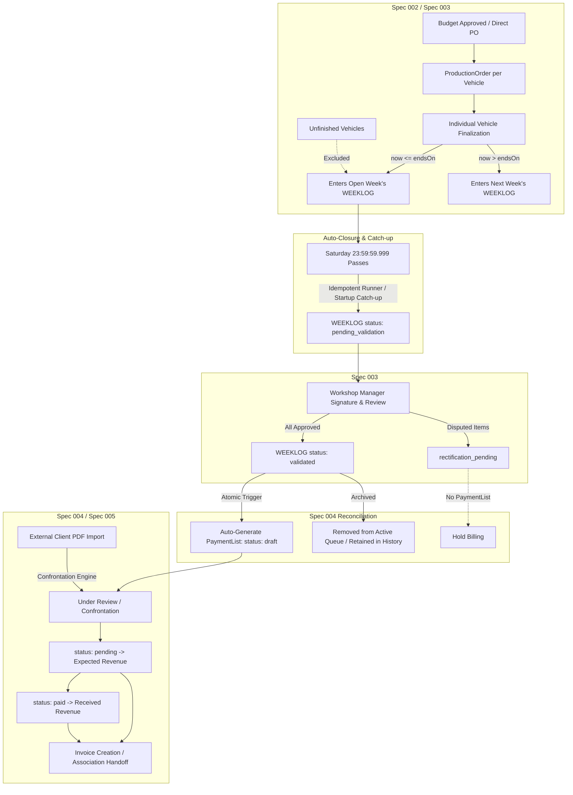

# Spec 006 / Phase 1 — Business Flow Reconciliation (Pre-Release R00/R01)

## 1. Executive Summary & Purpose
This specification formalizes the **Phase 1 Business Flow Reconciliation** for Operix Core, aligning the system implementation across Specs 003 (Weeklog), 004 (Payment List & Confrontation), and 005 (Essential Finance) with the operational and commercial flow confirmed by Alex / VECTIS prior to homologation and staging.

This is **not** a new product phase. It is a normative reconciliation patch that preserves all existing security boundaries, multi-tenant isolation, and relational invariants while harmonizing operational reality:
1. Production orders finalized in a given week automatically flow into that week's WEEKLOG.
2. The operational week strictly runs from **Sunday 00:00:00.000 to Saturday 23:59:59.999** in the workspace timezone.
3. Once the week boundary passes, the WEEKLOG coverage is **automatically frozen** and promoted to `pending_validation` (offline/restart catch-up guaranteed).
4. Validation and signature of the WEEKLOG by the client/workshop manager automatically transitions the work to a draft **PaymentList**.
5. The validated WEEKLOG remains permanently immutable and auditable in persistence, moving out of the default active queue into history.
6. The resulting PaymentList enables concise operational summary billing (matching the VECTIS model), confrontation against external client lists, and a minimal invoice handoff boundary.

---

## 2. Canonical Business Flow & State Transitions

---

## 3. Detailed Delta Classification Matrix

Each gap between current baseline (`cf0b8a55`) and the confirmed target flow is classified below:

| ID | Domain Area | Target Requirement | Current State | Classification |
|---|---|---|---|---|
| **D01** | Week Boundary | Sunday 00:00 to Saturday 23:59:59.999 calculation | Computed correctly in `operationalWeekOf` (`weekUtils.ts`) | **ALIGNED** |
| **D02** | Week Boundary | Auto-close expired open Weeklog (`now > endsOn`) to `pending_validation` | `submitWeeklogForValidation` is 100% manual; no scheduler or runner exists | **MISSING** |
| **D03** | Week Boundary | Downtime / startup catch-up for expired week closure | No background worker or boot-time reconciliation service exists | **MISSING** |
| **D04** | Week Boundary | Late vehicle finalization rolls forward to next active week | Calculated at `deliveredAt`, but if week remains open late it accepts entries | **PARTIAL** |
| **D05** | Week Boundary | Unfinished vehicles excluded from Weeklog | Only delivered POs enter Weeklog; invariants verified | **ALIGNED** |
| **D06** | Weeklog Validation | Complete validation triggers automatic draft PaymentList creation | `validateWeeklogBatch` sets `validated` but does not invoke `paymentListService` | **MISSING** |
| **D07** | Weeklog Validation | Idempotent list creation upon duplicate validation retries | No auto-creation handler exists | **MISSING** |
| **D08** | Weeklog Validation | Partial validation (`rectification_pending`) creates no List | N/A (no auto-list creation exists yet) | **MISSING** |
| **D09** | Weeklog Audit | Validated Weeklog and signature evidence remains immutable | Stored immutably in DB (`WeeklogValidation`, `signatureUrl`); no deletion | **ALIGNED** |
| **D10** | Weeklog Queue | Validated Weeklog disappears from default active queue | Default `listWeeklogs` query returns all statuses together | **MISSING** |
| **D11** | Weeklog UI | Concise projection (vehicle, site, date, services, total) | Dialog renders raw legacy snapshot and part details | **PARTIAL** |
| **D12** | Payment List | Generated list projection matches VECTIS billing model | List items carry vehicle details, but lack direct service summary concatenation | **PARTIAL** |
| **D13** | Payment List | Manual PaymentList creation remains intact | API route `POST /api/payment-lists` intact and verified | **ALIGNED** |
| **D14** | Payment List vs Import | Auto-listed entries do not block external import confrontation | Claim partial unique index blocks external confrontation if auto-list claims entries | **CONFLICTS_WITH_CURRENT_SPEC** |
| **D15** | Payment List | Multiweek list capability preserved | Supported by `PaymentList` design | **ALIGNED** |
| **D16** | Invoice Handoff | List triggers creation of draft invoice or association of invoice | Schema columns `invoiceId`, `documentId` exist; API routes and UI buttons are absent | **PARTIAL / MISSING** |
| **D17** | Finance | Auto draft List does not affect Expected or Received | Expected requires `status: 'pending'`, Received requires `status: 'paid'` | **ALIGNED** |
| **D18** | Finance | Only pending/paid drive Finance metrics | Enforced by Spec 005 domain services | **ALIGNED** |
| **D19** | Tenancy | All reconciliation logic strictly scoped to `workspaceId` | Verified in core services; must be preserved in new runner and routes | **ALIGNED** |

---

## 4. UI Semantics & VECTIS Field Mapping

### 4.1 WEEKLOG Business Projection
In the business-facing WEEKLOG view (validation and audit review), the user must see a concise operational row per vehicle rather than part/panel detail grids:

| Business Field | Source Model | Formatting / Example |
|---|---|---|
| **Site / Local** | `WeeklogEntry.serviceLocationSnapshot` / `Location.name` | `"VECTIS Atelier Nord"` |
| **Data de Conclusão** | `WeeklogEntry.deliveredAtSnapshot` | `"2026-09-25"` |
| **Veículo** | `WeeklogEntry.vehicleSnapshot.brand` + `model` | `"CITROËN C4"` |
| **Placa** | `WeeklogEntry.vehicleSnapshot.licensePlate` | `"EW-621-GF"` |
| **Chassi / VIN** | `WeeklogEntry.vehicleSnapshot.vin` | `"VF7NC5FS0AY123456"` |
| **Serviços Executados** | Concatenation of unique operational service names | `"DSP + Montagem + Pintura"` |
| **Valor Total** | `WeeklogEntry.totalAmount` | `"EUR 810.00"` |

### 4.2 PaymentList Billing Projection (VECTIS Sample Alignment)
Matching the real VECTIS homologation sample (`docs/Exemplos/L015170 GUILHERME QUALITY.pdf`):

| VECTIS Column | Operix Source Attribute | Semantic Mapping |
|---|---|---|
| **Véhicule / Immat / Chassis** | `PaymentListItem.vehicleDescription` / `licensePlate` / `vin` | Identificação unificada do veículo |
| **Date de livraison** | `PaymentListItem.completionDate` (from `WeeklogEntry.deliveredAtSnapshot`) | Data de entrega do veículo finalizado |
| **Site** | `PaymentListItem.serviceLocation` | Local da prestação do serviço |
| **Dégarnissage / T1 / Prestations** | `PaymentListItem.serviceSummary` | Resumo dos serviços reconhecidos |
| **Total Facturé / Reconnu** | `PaymentListItem.totalAmount` / `recognizedAmount` | Valor canônico para faturamento |

---

## 5. Security & Boundary Guarantees
1. **Zero Trust Tenant Scoping**: All auto-close checks, validation rounds, PaymentList generation, and invoice linking use verified `workspaceId`.
2. **Deny-by-Default Object Authorization**: Only users with `manage_production` / `manage_weeklogs` can validate or trigger lists.
3. **No Financial Mutation on Draft**: Creation of a draft PaymentList causes zero ledger adjustments in Spec 005.
4. **Permanent Audit Immutability**: WEEKLOG signatures and approval rounds cannot be deleted or modified once finalized.
