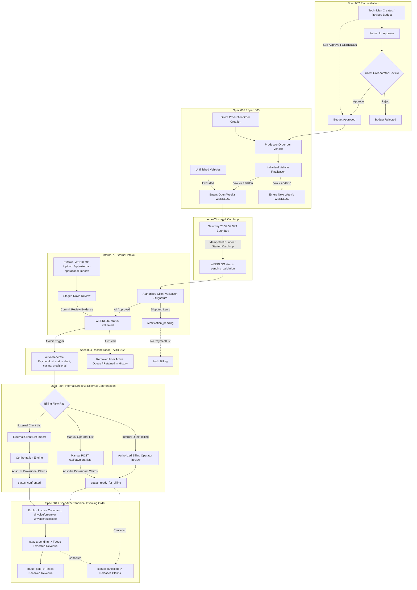

# Spec 006 / Phase 1 — Business Flow Reconciliation (Pre-Release R01C)

## 1. Executive Summary & Purpose
This specification formalizes the **Phase 1 Business Flow Reconciliation** (R01C) for Operix Core, incorporating the full operational requirements confirmed across both Alex / VECTIS meetings prior to homologation and staging.

This reconciliation patch spans **Specs 002 (Budget & Production), 003 (Weeklog), 004 (Payment List & Confrontation), and 005 (Essential Finance)**. It preserves all zero-trust tenant boundaries (`RequestContext.activeWorkspaceId`), anti-double-billing guarantees, and relational invariants, while eliminating discrepancies between the brownfield implementation and real-world commercial operations:

1. **Budget Authority & Client Governance (Spec 002)**: Technicians create and revise Budgets, but **executor technicians are strictly forbidden from self-approving or self-rejecting budgets**. Approval/rejection belongs strictly to authorized Client Collaborators within their client scope. Direct Production Orders remain fully supported without requiring budget approval (`DIRECT-PO-PRESERVED-01`). Rejection reasons are classified as engineering audit refinements rather than mandatory meeting rules.
2. **Operational Week & Automated Boundary (Spec 003)**: The operational week runs strictly from **Sunday 00:00:00.000 to Saturday 23:59:59.999** in workspace timezone. Expired weeks are **automatically frozen** to `pending_validation` via idempotent background runner and startup catch-up.
3. **Dual WEEKLOG Intake (Internal & External)**: Both internal vehicle finalizations and external client WEEKLOG uploads (with staging review in canonical `POST /api/external-operational-imports`) transition to `validated` status, preserving audit evidence without fake ProductionOrders.
4. **Deterministic Authoritative Draft List Handoff (Spec 004 / ADR-002)**: Validated WEEKLOGs automatically produce a draft `PaymentList` with provisional claims (`status = 'provisional'`). External multiweek client lists absorb provisional claims deterministically, ensuring zero double-billing. Manual lists cleanly coexist by absorbing provisional auto-claims (`LIST-MANUAL-AUTO-COEXIST-01`).
5. **Concise Projections & Importer UX**: Minimal operational projections (vehicle, delivery date, site, services, recognized amount) without panel-level clutter; full document preview (zoom, rotation, bulk correction) preserved in import workflow.
6. **Canonical Invoicing Order & Direct Billing**:
   - **Internal Flow**: `draft` $\rightarrow$ `ready_for_billing` $\rightarrow$ `invoice/create` OR `invoice/associate` $\rightarrow$ `pending` $\rightarrow$ `paid`.
   - **External Flow**: `under_review` $\rightarrow$ `confronted` $\rightarrow$ `invoice/create` OR `invoice/associate` $\rightarrow$ `pending` $\rightarrow$ `paid`.
   - PaymentList **MUST NOT** transition to `pending` before invoice handoff. Finance `Expected` revenue starts strictly at `pending`.
7. **UI Release Gates**: Formal staging gates with static checks and planned browser homologation (light mode, mobile/tablet responsiveness, Operix branding, automation hidden).

---

## 2. Canonical End-to-End Business Flow

---

## 3. Comprehensive Delta Classification Matrix (Specs 002–005)

| Ref ID | Feature / Invariant Area | Current Spec002-005 Baseline | Confirmed Alex/VECTIS Rule | Classification |
| :--- | :--- | :--- | :--- | :--- |
| **D-01** | **Technician Budget Self-Approval** | Spec002 allowed technician author to self-approve own budget (`TECH-BUDGET-APPROVE-OWN`). | **Technicians are strictly forbidden from approving/rejecting own budgets**. | `CONFLICTS_WITH_CURRENT_SPEC` (Superseded) |
| **D-02** | **Budget Client Governance Scope** | Any workspace member could approve budget if object authorization matched. | Approval strictly reserved to `ClientAccessGrant` holders with `capability: budget.approve`. | `MISSING` |
| **D-03** | **Budget Revision Re-submission** | Minor revisions could be silently updated. | Any modification to an approved budget creates a new revision that must undergo formal client re-approval. | `ALIGNED` |
| **D-04** | **Cross-Client Budget Approval** | Not explicitly blocked by client grant check in budget route. | Deny-by-default cross-client approval; grant must match `budget.clientId`. | `MISSING` |
| **D-05** | **Client Collaborator Capabilities** | `ClientAccessGrant` only had a generic role (`validator`). | Explicit granular capabilities: `budget.approve`, `weeklog.validate`, `payment_list.review`, `invoice.view`. | `MISSING` |
| **D-06** | **Client Platform/Local Scope** | Grants had no `siteKey` or `locationId` scope restriction. | Optional `siteKey`/`locationId` restriction (`null` = client-wide; `value` = platform-specific). | `MISSING` |
| **D-07** | **Client Access to Internal Ledger** | Role hierarchy prevented member access to internal finance. | Client collaborators strictly blocked from internal finance ledger routes. | `ALIGNED` |
| **D-08** | **Week Boundary Saturday 23:59:59.999** | Date arithmetic existed in `weekUtils.ts`. | Canonical operational boundary strictly enforced. | `ALIGNED` |
| **D-09** | **Automatic Week Closure Engine** | Submission for validation was 100% manual. | Expired coverage automatically freezes to `pending_validation` via cron and startup runner. | `MISSING` |
| **D-10** | **Late Ingestion Prevention** | Validated via `WEEK-BOUNDARY-ROLLFORWARD-01` (GREEN). | Vehicles finalized after Saturday boundary belong strictly to next operational week. | `ALIGNED` |
| **D-11** | **Unfinished Vehicle Exclusion** | Unfinished POs (`in_progress`, `paused`) do not enter WEEKLOG. | Incomplete work never enters weekly batch. | `ALIGNED` |
| **D-12** | **External WEEKLOG Intake & Review** | Implemented via `POST /api/external-operational-imports`. | Existing route stages rows and commits to `validated`. Delta is purely automatic draft List handoff. | `PARTIAL` |
| **D-13** | **Importer UX Document Controls** | Importer review endpoints exist; UI controls need reconnection. | Original PDF/image visible, rotation, zoom, editable table, bulk column apply downward. | `MISSING` (UI Contract) |
| **D-14** | **Authoritative Draft List Handoff** | Validation ended weeklog lifecycle; List creation was manual. | Complete batch validation automatically creates exactly 1 draft `PaymentList`. | `MISSING` |
| **D-15** | **Incomplete/Rectification Hold** | Partial validation marked `rectification_requested`. | Disputed/unapproved items do NOT generate a PaymentList. | `ALIGNED` |
| **D-16** | **Source-Aware Claims (ADR-002)** | Single active unique constraint caused collision on external import. | Provisional claim status (`status = 'provisional'`) with absorption and non-blocking confrontation. | `MISSING` |
| **D-17** | **Direct Internal Billing Path** | All billing forced through confrontation. | Billing operator reviews auto-draft list (`ready_for_billing`) $\rightarrow$ `/invoice/create` $\rightarrow$ `pending`. | `MISSING` |
| **D-18** | **Active Queue Filtering** | `GET /api/weeklogs` listed validated weeklogs. | Validated weeklogs hidden from active queue; available only under history filter. | `PARTIAL` |
| **D-19** | **Concise Operational Projections** | UI rendered parts and damage detail tables by default. | Minimal operational summary: vehicle, delivery date, site, services, amount. | `MISSING` |
| **D-20** | **Production Chronological Timeline** | Timeline was disabled or mocked in UI. | Canonical chronological facts (`created` $\rightarrow$ `in_production` $\rightarrow$ `finalized` $\rightarrow$ `weeklog` $\rightarrow$ `rectification`). | `MISSING` |
| **D-21** | **Explicit Invoice Commands** | Nullable `invoiceId` on `PaymentList`, but no command routes. | Explicit commands: `POST /api/payment-lists/:id/invoice/create` & `/invoice/associate`. | `MISSING` |
| **D-22** | **Finance V2 Boundaries** | Draft lists produce zero financial impact; `pending`/`paid` drive Expected/Received. | Preserved without change. Zero automatic expenses. `Expected` starts strictly at `pending`. | `ALIGNED` |
| **D-23** | **Contractual UI Gates** | Static CSS tokens defined; runtime homologation pending; residual Nexus branding. | Accessible light mode, responsive layout, Operix brand hygiene, automation hidden. | `PARTIAL` |

---

## 4. Canonical VECTIS Semantic Field Mapping

The generated `PaymentList` and concise `WEEKLOG` projection map directly to the canonical VECTIS invoice format:

| VECTIS Business Field | Operix Source Entity | Target Schema Attribute | Display Example |
| :--- | :--- | :--- | :--- |
| **Véhicule** | `ProductionOrder` / `Budget` | `${brand} ${model}` | `BMW Serie 1` |
| **Immatriculation** | `ProductionOrder` / `Budget` | `licensePlate` | `EW-621-GF` |
| **Châssis / VIN** | `ProductionOrder` / `Budget` | `vin` | `WBA1V710305G06196` |
| **Date de livraison** | `WeeklogEntry.deliveredAt` | `deliveryDate` (ISO) | `2026-09-18` |
| **Site / Local** | `Weeklog.siteKey` | `siteKey` / `locationName` | `Platform Lyon Nord` |
| **Prestation(s)** | `servicesSnapshot` / `performedServices` | `servicesSummary` (joined) | `Dégarnissage + T1` |
| **Montant H.T.** | `WeeklogEntry.totalAmount` | `itemAmount` (Decimal) | `EUR 810.00` |
